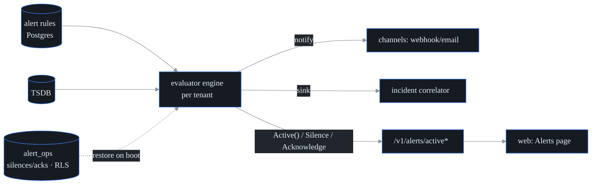

# Alerting

**What this is.** The part of probectl that watches metrics and tells a human when
something is wrong. It has two halves that together form one truth:

- **Alert rules** — durable config in Postgres. A rule is a threshold or baseline
  condition over any time-series (TSDB) metric, with debounce (`for_n`), a
  renotify cadence, a severity, and delivery channels (HMAC-signed webhook or
  email). Full CRUD at `/v1/alerts` (RBAC `alert.read` / `alert.write`).
- **Active alerts** — the engine's live truth: what is firing *right now*. The
  evaluator engine (`internal/alert`) is the single source of truth. The API and
  the web UI only *render* its state and *forward* operator actions; nothing about
  what is firing is computed client-side.

Why split it this way? Rules are operator intent and must survive restarts, so
they live in the database. "What is firing" is a live computation over the latest
samples — deriving it from the engine on every read means the UI can never drift
from reality or show a stale "firing" badge.

## Active-alert API

| Route | Perm | Meaning |
| --- | --- | --- |
| `GET /v1/alerts/active` | `alert.read` | Every firing series for the caller's tenant, with operator state. `evaluator_running=false` distinguishes "quiet" from "not evaluating". |
| `POST /v1/alerts/active/silence` | `alert.write` | `{fingerprint, duration_minutes}` — suppress notifications until the deadline (`0` clears; max 7 days). |
| `POST /v1/alerts/active/ack` | `alert.write` | `{fingerprint}` — record the caller as owning the alert. |

Each firing series carries an opaque `fingerprint` — the `(rule, label-set)`
identity, which is the handle for actions. Both actions are:

- **tenant-scoped** — the caller's tenant selects its own evaluator engine; an
  unknown tenant fails closed (503 / not-found, never another tenant's engine);
- **audited** — `alert.silence` / `alert.acknowledge` go to the tamper-evident
  log; and
- they return the engine's *updated* view, so the UI re-renders from engine truth.

## Semantics (the operator contract)

- **Silence** suppresses channel notifications *and* the incident sink for one
  series until the deadline. Mechanically, a silenced series short-circuits the
  notify path in the engine (`transition()` returns "no alert"), so neither the
  webhook/email channels nor the incident correlator fire. The series keeps
  evaluating and stays visibly firing (badged as silenced). When it resolves, the
  silence clears and the recovery notification is still sent.
- **Acknowledge** is bookkeeping: who has seen / owns it. Evaluation and delivery
  are unchanged; the ack clears on resolve.
- A new firing episode never inherits the previous episode's silence/ack — when a
  series resolves, the engine wipes its operator state so the next episode starts
  clean.

### Silences and acks survive a restart

Firing state itself is engine-derived: it re-computes on the first evaluation
after a control-plane restart, so it is never persisted. But a **silence or ack is
operator input** that cannot be re-derived from any stream — losing it on restart
would re-page someone who had deliberately quieted an alert. So silences and acks
*are* persisted, in the `alert_ops` table (migration `0043`, tenant-RLS), as the
one sanctioned exception to "alerting state is volatile" (see
`docs/adr/volatile-stores.md`).

The mechanics are restart-safe without leaking across episodes:

- On boot, the API layer loads each tenant's persisted ops and seeds the engine
  (`Engine.RestoreOps`). A restored silence/ack is **re-applied the first time its
  fingerprint fires again** (an expired silence is skipped) — so it never
  resurrects an episode that had already ended.
- When an episode resolves, a resolve hook (`Engine.SetResolveHook`) deletes the
  persisted row, so a *future* episode of the same series starts with no inherited
  state.

## The web surface

`/alerts` on the app shell: the active-alert table (state + severity filters,
detail with silence/acknowledge actions) sits over the rule table (create / edit /
delete with threshold/baseline forms). It is built entirely from the shared
design-system components and tokens (the WCAG 2.2 AA gate covers it). The active
list polls the engine every 15s, and every action re-renders from the engine's
response — the UI shows engine truth, not a client-side guess.

## Testing

`go test ./internal/alert ./internal/control` covers the engine state machine
(episode start, silence suppression including renotify windows + expiry, resolve
clearing operator state, fail-closed errors), restart restore-and-cleanup of
silences/acks, and the handlers (RBAC perms, tenant fail-closed, 404/422/503
paths). `cd web && npx vitest run` covers the surface: list + filters, silence/ack
rendering engine truth, rule create, tenant scoping (no client-side tenant
selection), evaluator-off honesty, and the axe a11y pass.
