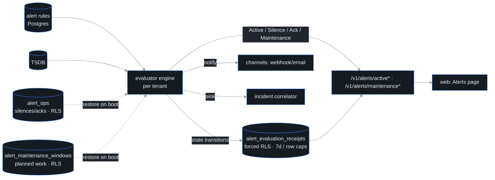

# Alerting

**What this is.** The part of probectl that watches metrics and tells a human when
something is wrong. It has two halves that together form one truth:

- **Alert rules** — durable config in Postgres. A rule is a **threshold**
  condition (value crosses a fixed line) or a **baseline** condition (value
  deviates from its own learned normal) over any metric in the TSDB (the
  time-series database), with **debounce** (`for_n` — the condition must hold
  for N consecutive evaluations before firing, so one noisy sample can't page
  anyone), a **renotify cadence** (how often a still-firing alert may repeat its
  notification), a severity, and delivery channels (HMAC-signed webhook — a
  webhook is an HTTP POST to a URL you choose; the HMAC is a signature computed
  over the body with a shared secret so the receiver can verify the sender — or
  email). Full CRUD at `/v1/alerts` (RBAC `alert.read` / `alert.write`).
- **Active alerts** — the engine's live truth: what is firing *right now*. The
  evaluator engine (`internal/alert`) is the single source of truth. The API and
  the web UI only *render* its state and *forward* operator actions; nothing about
  what is firing is computed client-side.
- **Maintenance windows** — reusable planned hush rules for known work. Think
  "we are patching the database every Thursday at 02:00, so matching alerts stay
  visible but do not page during that window." They are tenant-scoped, can match
  rule IDs and/or resource labels, support daily/weekly recurrence, have a
  preview API, survive control-plane restarts, and create audit events when
  changed.

Two honesty notes on delivery. The **webhook** channel is the fully-wired path
(HTTPS POST, body signed with HMAC-SHA256 in `X-Probectl-Signature`). The
**email** channel type exists end to end (a plain-text message via an SMTP
sender), but the shipped control plane does not yet wire a mail sender or
expose SMTP configuration — a rule with an email channel is skipped with a
logged warning until one is wired. This is tracked as a built-not-yet-served
edge in the canonical [limitations table](limitations.md#built-not-yet-served-edges).
And per-rule channels are only half the notification story: incident-level
paging, chat, and ticketing connectors (PagerDuty, Opsgenie, Slack, Teams,
ServiceNow, Jira) ride the *incident* pipeline, not alert rules — see
[`docs/oncall-itsm.md`](oncall-itsm.md).

Why split it this way? Rules are operator intent and must survive restarts, so
they live in the database. "What is firing" is a live computation over the latest
samples — deriving it from the engine on every read means the UI can never drift
from reality or show a stale "firing" badge.

For incident response, the alert is only the starting signal. probectl pushes
that signal into the tenant-scoped incident timeline so the same view can show
the related BGP, flow, eBPF, device, change, and SLO evidence. The implemented
claim stops there: related signals are consolidated into one incident view.
Reducing MTTI or MTTR is a design intent, not a measured outcome; no customer or
proof-of-value receipt in this repository currently measures either one.


```mermaid
%%{init: {'theme':'base','themeVariables':{'background':'#0d1117','primaryColor':'#161b22','primaryTextColor':'#e6edf3','primaryBorderColor':'#3b82f6','lineColor':'#8b949e','secondaryColor':'#21262d','tertiaryColor':'#0d1117','clusterBkg':'#161b22','clusterBorder':'#30363d','fontFamily':'ui-monospace, SFMono-Regular, Menlo, monospace'},'flowchart':{'curve':'basis','nodeSpacing':55,'rankSpacing':55,'padding':12}}}%%
flowchart LR
  R[(alert rules\nPostgres)] --> E[evaluator engine\nper tenant]
  T[(TSDB)] --> E
  O[(alert_ops\nsilences/acks · RLS)] -. restore on boot .-> E
  M[(alert_maintenance_windows\nplanned work · RLS)] -. restore on boot .-> E
  E -- state transitions --> V[(alert_evaluation_receipts\nforced RLS · 7d / row caps)]
  E -- notify --> C[channels: webhook/email]
  E -- sink --> I[incident correlator]
  E -- "Active / Silence / Ack / Maintenance" --> A["/v1/alerts/active* · /v1/alerts/maintenance*"]
  V --> A
  A --> W[web: Alerts page]
```

<a id="evaluation-loop"></a>

The evaluator ticks every `PROBECTL_ALERT_EVAL_INTERVAL` (default `30s`),
syncs the active tenant set, and keeps one evaluator engine per active tenant.
Each engine re-reads that tenant's enabled rules through the row-level-security
choke point (RLS — the database itself filters every query to one tenant's rows)
on each pass. The metric read path is tenant-scoped in both supported modes:
lightweight deployments query the in-process TSDB, while
`PROBECTL_TSDB_MODE=prometheus` deployments query the Prometheus/VictoriaMetrics
instant-query backend with a forced `tenant_id` matcher. If neither metric query
backend is wired, APIs surface `evaluator_running: false` rather than showing a
falsely empty "all clear".

When evaluation is inactive, the condition is deliberately persistent and
machine-readable: `/alerts` shows a page-level warning with setup guidance,
every `probectl alert ...` command warns on stderr, `/readyz` reports
`alerting.status=degraded` with `evaluator_running=false`, and
`/v1/diagnostics` includes a degraded `alert_evaluator` check. Readiness remains
HTTP 200 because the API can still serve and preserve rule configuration; the
explicit degraded field is the automation signal.

## Active-alert API

| Route | Perm | Meaning |
| --- | --- | --- |
| `GET /v1/alerts/active` | `alert.read` | Every firing series for the caller's tenant, with operator state. `evaluator_running=false` distinguishes "quiet" from "not evaluating". |
| `GET /v1/alerts/{rule-id}/evaluations` | `alert.read` | Bounded deterministic state transitions for one tenant-authorized rule. Optionally pass the active alert's `evaluation_fingerprint` and `limit=1..100`. |
| `GET /v1/alerts/active/{fingerprint}/workflow` | `alert.read` | Join engine truth, immutable ack/silence receipts, an optional freshly authorized `incident_id`, and persisted connector/ticket receipts. Missing or other-tenant references fail closed. |
| `POST /v1/alerts/active/silence` | `alert.write` | `{fingerprint, duration_minutes, reason}` — suppress notifications until the deadline (`0` clears; max 7 days) and return the durable audit receipt. |
| `POST /v1/alerts/active/ack` | `alert.write` | `{fingerprint, reason}` — record the caller as owning the alert and return the durable audit receipt. |
| `GET /v1/alerts/maintenance` | `alert.read` | Reusable planned windows for the caller's tenant evaluator. |
| `POST /v1/alerts/maintenance` | `alert.write` | Create/update a window: `{name, starts_at, ends_at, recurrence, match, rule_ids}`. |
| `POST /v1/alerts/maintenance/preview` | `alert.read` | Preview matching saved or draft windows over a bounded range (`<=90d`). |
| `DELETE /v1/alerts/maintenance/{id}` | `alert.write` | Remove a reusable planned window. |

Each firing series carries an opaque `fingerprint` — the `(rule, label-set)`
identity, which is the handle for actions. Both actions are:

- **tenant-scoped** — the caller's tenant selects its own evaluator engine; an
  unknown tenant fails closed (503 / not-found, never another tenant's engine);
- **audited** — `alert.silence` / `alert.acknowledge` go to the tamper-evident
  log; and
- **durable** — the operation and audit event commit together, or the request
  fails rather than claiming a receipt that was not stored; and
- they return the engine's *updated* view plus actor, reason, start/expiry, and
  immutable audit reference, so the UI can render the write receipt immediately
  while the workflow read catches up.

## Evaluation receipts: why the alert changed state

Every active alert also carries a separate `evaluation_fingerprint`. It is the
handle for its server-authored evaluation ledger; it is deliberately separate
from the action fingerprint so silence/ack restart compatibility does not depend
on an explanation API. Fetch it with:

```sh
probectl alert evaluations <rule-id> \
  --query fingerprint='<evaluation_fingerprint>' \
  --query limit=64
```

The response records state changes only: `no_data`, baseline `warming`,
`normal`, debounce `pending`, first `firing`, renotify `steady`, and
`resolved`. Each receipt includes the observed value, the fixed threshold or
learned baseline band, current/required breach counts, baseline sample progress,
rule revision, reason, and sanitized series labels. It does **not** contain SQL,
a physical query plan, global cardinality, an ambient tenant ID, or hidden data
from another series. Think of it as the smoke detector showing the exact sensor
reading and trip line, not as a general-purpose log database.

The ledger is intentionally small:

- at most 64 receipts per series;
- at most 256 receipts per rule;
- seven-day expiry; and
- at most 100 rows in one API read.

Migration `0065_alert_evaluation_receipts.sql` creates `tenant_id` on the table
from its first version, forces PostgreSQL RLS, and indexes tenant-first reads.
Every store statement also binds `tenant_id`, so both the database boundary and
the query text must agree. Deleting a rule deletes its receipts in the same
tenant transaction; expiry remains the bounded cleanup fallback. A receipt
write failure is logged but never stops the evaluator or notification path.
`persistence_running`, `evaluator_running`, `freshness`, and `truncated` keep
missing, stale, and partial history explicit instead of presenting a false
empty timeline.

## Semantics (the operator contract)

Silence and acknowledge are the two things an operator can do to a firing
alert, and they are deliberately different: **silence is the smoke alarm's hush
button** — the detector keeps detecting and the light stays on, it just stops
sounding for a while; **acknowledge is signing the station logbook** — it says
"this one is mine" and changes nothing about the alarm itself.

- **Silence** suppresses channel notifications *and* the incident sink for one
  series until the deadline. Mechanically, a silenced series short-circuits the
  notify path in the engine (`transition()` returns "no alert"), so neither the
  webhook/email channels nor the incident correlator fire. The series keeps
  evaluating and stays visibly firing (badged as silenced). When it resolves, the
  silence clears and the recovery notification is still sent.
- **Acknowledge** is bookkeeping: who has seen / owns it. Evaluation and delivery
  are unchanged; the ack clears on resolve.
- **Maintenance window** is a calendar hush rule: it suppresses matching firing
  notifications while the window is active, but the alert still shows in the
  active list with `silenced_until` set to the occurrence end. When the window
  expires, a still-breaching series can notify immediately because the original
  firing notification was deliberately suppressed.
- A new firing episode never inherits the previous episode's silence/ack — when a
  series resolves, the engine wipes its operator state so the next episode starts
  clean.

### Operator intent survives a restart

Firing state itself is engine-derived: it re-computes on the first evaluation
after a control-plane restart, so it is never persisted. But a **silence or ack is
operator input** that cannot be re-derived from any stream — losing it on restart
would re-page someone who had deliberately quieted an alert. So silences and acks
*are* persisted, in the `alert_ops` table (migration `0043`, tenant-RLS), as the
one sanctioned exception to "alerting state is volatile" (see
`docs/adr/volatile-stores.md`).

The mechanics are restart-safe without leaking across episodes:

- On boot, the API layer loads each tenant's persisted ops and seeds the engine
  (`Engine.RestoreOps`). A restored silence/ack is **re-applied the first time its
  fingerprint fires again** (an expired silence is skipped) — so it never
  resurrects an episode that had already ended.
- When an episode resolves, a resolve hook (`Engine.SetResolveHook`) deletes the
  persisted row, so a *future* episode of the same series starts with no inherited
  state.
- Planned maintenance is also operator intent, so it is stored in
  `alert_maintenance_windows` (migration `0058`, forced tenant RLS) and restored
  into each tenant evaluator at startup. Create/update/delete changes the engine,
  tenant row, and audit trail as one logical operation; a failed database write
  rolls the engine change back.

## The web surface

`/alerts` on the app shell: the active-alert table (state + severity filters)
sits over durable rules and maintenance windows. Its detail is one compact
alert-to-postmortem workbench: engine state, the native threshold/baseline state
timeline, bounded silence/ack actions, immutable operator receipts,
connector/ticket delivery status, and the linked incident. An opened detail
stays open when its state changes even if the table's current filter would hide
the updated row. The active list polls the engine every 15s; expired silence
returns visibly to firing. The surface uses only the shared design-system
components/tokens and remains under the WCAG 2.2 AA gate.

## Testing

`go test ./internal/alert ./internal/control` covers the engine state machine
(episode start, silence suppression including renotify windows + expiry, resolve
clearing operator state, exact evaluation-transition sequence, threshold math,
baseline warmup/bands, fail-closed errors), restart restore-and-cleanup of
silences/acks, planned-window suppression/expiry/recurrence/tenant isolation,
and the handlers (RBAC perms, tenant fail-closed workflow, evaluation, and
incident references, preview, and 404/422/503 paths). Named two-tenant
integration tests prove maintenance and evaluation rows cannot cross forced RLS;
control tests prove window audit events land in the tenant trail. `cd web && npx
vitest run` covers the surface: list + filters, deterministic evaluation
timeline, the four-interaction alert-to-postmortem journey, durable receipts,
expired silence, blocked connectors, tenant scoping (no client-side tenant
selection), evaluator-off honesty, and the axe a11y pass.
