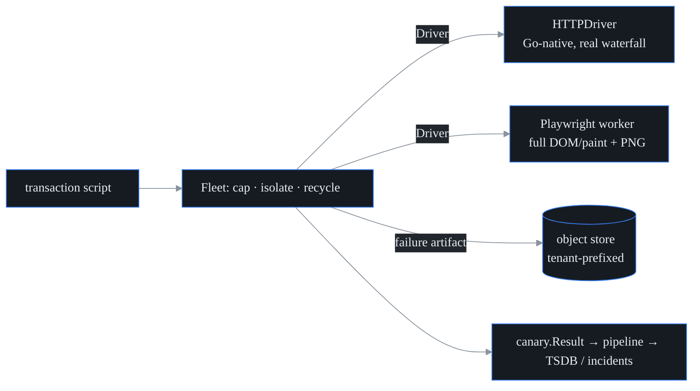

# Browser / transaction synthetic

> **Status: shipped and schedulable.** `browser` is a first-class synthetic test
> type in the REST API, CLI, web UI, test schema, and agent registry. The shipped
> schedulable path runs the Go-native HTTP transaction driver through the browser
> fleet, emits per-step timings as normal canary metrics, and is protected by the
> same private-target SSRF guard as HTTP/TCP/UDP/DNS/voice probes. The Playwright
> worker remains the rendering-capable driver component; the default agent path
> does not spawn Chromium.

## What it is

This is the **canary** (probectl's name for one scheduled synthetic test type)
that drives a **scripted multi-step transaction** — a login, a checkout — and
reports per-step timings plus a page-load **waterfall** (the per-request timing
ladder: when each resource's DNS lookup, connection, TLS handshake, and first
byte happened — a Gantt chart of the page load). The shipped driver is
Go-native and reads the transaction as HTTP, so it works anywhere the agent
runs. The rendering-capable Playwright worker can add **DOM/paint timings** and
visual screenshots, but the default scheduled canary path keeps Chromium out of
the single-binary agent.



## Two drivers, one contract

Both drivers implement the same `Script → Result` contract (the
`internal/browser.Driver` interface). The schedulable `browser` canary currently
instantiates the HTTPDriver; the Playwright worker remains the full-rendering
driver component behind the same contract.

| | **HTTPDriver** (default) | **Playwright worker** |
| - | ------------------------ | --------------------- |
| Runtime | Go-native, no browser | headless Chromium (`browser-worker/`) |
| Waterfall | real, per request (DNS / connect / TLS / TTFB / total) | real, per resource |
| DOM/paint timings | – | yes |
| Screenshot | the failed page's HTML body | a visual PNG |
| Runs | anywhere (incl. air-gapped, CI); current scheduled path | needs the Playwright image |

(**Playwright** is the browser-automation framework the worker is built on — it
drives a real Chrome engine from code; **headless** Chromium is that engine run
without a visible window.) The two drivers are a table read versus a full dress
rehearsal: the HTTPDriver *reads the script* as raw HTTP — every request,
timing, and status real, nothing rendered; the Playwright worker *stages it* in
a real browser, adding what only rendering can show (DOM/paint timings, a
visual screenshot). The HTTPDriver makes transaction monitoring available
*everywhere* and is fully unit-tested; the Playwright worker adds true rendering
on top. Browser rendering is delegated to a separate worker process (over the
`ExecDriver` contract) precisely to keep a whole browser *out* of probectl's
single-binary agent.

## Transaction script format

A script is JSON, parsed and validated by `internal/browser/script.go`:

```json
{
  "name": "login",
  "start_url": "https://app.example/login",
  "steps": [
    {"action": "goto"},
    {"action": "fill",   "selector": "[name=username]", "field": "username", "value": "alice"},
    {"action": "fill",   "selector": "[name=password]", "field": "password", "value": "secret"},
    {"action": "click",  "selector": "button[type=submit]"},
    {"action": "assert_text",   "value": "Welcome"},
    {"action": "assert_status", "status": 200}
  ]
}
```

The full action vocabulary: `goto`, `fill`, `click`, `submit`, `wait_text`,
`assert_text`, `assert_status`, `screenshot`. The two drivers read the fields
they each need — the browser driver uses `selector` (a DOM element), the HTTP
driver uses `field` (a form field name) plus `url` (the submit target).

## Result fields

Each run produces a `Result` (`internal/browser/result.go`): `success`/`error`,
`total_ms`, `steps[]` (each with name / action / success / duration),
`waterfall[]` (each request's url / method / status plus DNS / connect / TLS /
TTFB / total), `dom` (DOMContentLoaded / load / first-paint / first-contentful-
paint when a rendering driver supplies it), and a `screenshot` reference when a
failure artifact is stored. The run is then mapped onto the canonical
`canary.Result` (type `browser`), so it flows through the *same* pipeline → TSDB
/ incident path as every other canary: total time, resource counts, and
`transaction.step.<n>.duration_ms` become metrics; step name/action/success and
the screenshot key become attributes.

## Fleet: isolation, concurrency, recycling

Because browser workers are CPU- and memory-heavy, the `Fleet`
(`internal/browser/fleet.go`):

- **caps concurrency** — a worker pool of `MaxConcurrency`; extra runs block
  until a worker is free;
- **isolates each run** — a `RunTimeout` context bounds every run (default 60s);
  for the Playwright worker, a timeout *kills the worker process* (via
  `exec.CommandContext`);
- **recycles workers** — after `RecycleAfter` runs, or after any failed run, the
  driver is `Close()`d and rebuilt (this bounds resource leaks and restarts a
  crashed browser);
- **degrades safely** — a panicking run is caught and the worker recycled,
  rather than taking the fleet down.

## Screenshots → object store

A failure artifact is uploaded to the pluggable **object store** — a key → blob
store: `Put` bytes under a string key, `Get` them back (`internal/objectstore`).
The fleet writes through a **tenant-bound object handle**: it passes only the
relative artifact path (`browser/<script>-<ts>.png`), and the store adapter
prepends the tenant namespace (`tenant/<id>/...` or a routed `silo/<id>/...`).
That keeps one tenant's artifacts isolated from another's at the storage layer
(siloed tenants get their own prefix via isolation routing; a routing failure
stores nothing — fail closed).
Two implementations ship today: **filesystem** (the default) and **in-memory**
(tests). The store is a deliberately small `Store` interface
(`Put`/`Get`/`Stat`/`List`/`DeletePrefix`), so an S3 / MinIO backend can slot
in behind it — pluggable by design, but
[**not shipped yet**](limitations.md#built-not-yet-served-edges); don't plan a
deployment around S3 support that isn't there.

Successful runs store nothing by default (to bound storage); set
`StoreOnSuccess` to keep them. Object-lifecycle / retention policy is applied at
the store itself.

## Deploy

No extra process is required for the shipped scheduled path: `probectl-agent`
registers `browser`, builds a one-slot browser `Fleet`, and runs the HTTPDriver
with the shared canary target guard. To create one from the CLI, either omit
`script` and let the agent create a default `goto target + assert HTTP 200`
transaction, or pass the script JSON explicitly:

```sh
probectl test create \
  --name login-browser \
  --type browser \
  --target https://app.example/login \
  --param 'script={"name":"login","start_url":"https://app.example/login","steps":[{"action":"goto"},{"action":"assert_status","status":200}]}'
```

The Playwright worker ships as `browser-worker/` — a `Dockerfile` built on the
official Playwright image (Chromium + OS deps preinstalled), run as the image's
non-root `pwuser`. The worker reads one Script as JSON on stdin and writes the
Result as JSON on stdout (the process's standard input and output pipes — no
listening port, no API surface). It is the rendering-capable driver component,
not the default scheduled agent path. For the surrounding stack — bringing up
the control plane and bus, and the per-producer deployment journeys — start at
[`getting-started.md`](getting-started.md) and
[`deploying-agents.md`](deploying-agents.md).

## Notes

- **Integration status (honest).** Browser transactions are schedulable as
  ordinary `browser` tests from REST, CLI, and the web UI. The agent registry
  runs them through the HTTPDriver, and `/v1/results/latest` exposes the
  per-step timing attributes the UI renders. Rendering through Playwright is
  still a separate driver component rather than the default scheduled path.
- **Architecture choice.** The script format, result model, object-store upload,
  and fleet isolation/concurrency/recycling all live in Go (`internal/browser`,
  fully tested); only rendering is delegated to the external Playwright worker.
  This is what keeps browsers out of the single-binary agent.
- **Out of scope.** Real-user monitoring ([`rum.md`](rum.md)) and endpoint
  browser-session capture are separate features. Note that some sites detect
  headless browsers; for those, configure a realistic user-agent / browser
  context.
