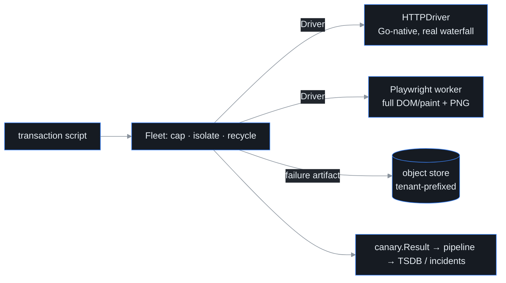

# Browser / transaction synthetic

> **Status: shipped and schedulable.** `browser` is a first-class synthetic test
> type in the REST API, CLI, web UI, test schema, and agent registry. Both the
> non-rendering HTTP transaction driver and the rendered Playwright driver are
> connected to the shipped agent. Each agent selects one driver at startup and
> each test names the semantics it requires; a mismatch is rejected rather than
> silently substituting HTTP for a rendered browser. Both paths enforce the
> private-target SSRF guard.

## What it is

This is the **canary** (probectl's name for one scheduled synthetic test type)
that drives a **scripted multi-step transaction** — a login, a checkout — and
reports per-step timings plus a page-load **waterfall** (the per-request timing
ladder: when each resource's DNS lookup, connection, TLS handshake, and first
byte happened — a Gantt chart of the page load). The ordinary agent defaults to
the Go-native HTTP driver. The dedicated `probectl-browser-agent` release image
packages that same tenant-bound Go agent with the listener-free Playwright
worker for **DOM/paint timings** and visual screenshots.


```mermaid
%%{init: {'theme':'base','themeVariables':{'background':'#0d1117','primaryColor':'#161b22','primaryTextColor':'#e6edf3','primaryBorderColor':'#3b82f6','lineColor':'#8b949e','secondaryColor':'#21262d','tertiaryColor':'#0d1117','clusterBkg':'#161b22','clusterBorder':'#30363d','fontFamily':'ui-monospace, SFMono-Regular, Menlo, monospace'},'flowchart':{'curve':'basis','nodeSpacing':55,'rankSpacing':55,'padding':12}}}%%
flowchart LR
  S[transaction script] --> F[Fleet: cap · isolate · recycle]
  F -->|Driver| H[HTTPDriver\nGo-native, real waterfall]
  F -->|Driver| P[Playwright worker\nfull DOM/paint + PNG]
  F -- failure artifact --> O[(object store\ntenant-prefixed)]
  F --> R[canary.Result → pipeline → TSDB / incidents]
```

## Two drivers, one contract

Both drivers implement the same `Script → Result` contract (the
`internal/browser.Driver` interface). `browser.driver` in agent YAML chooses
`http` or `browser`; `params.browser_driver` on a test declares the required
semantics. Legacy tests without the parameter mean `http`. A rendered agent
therefore refuses a legacy/HTTP test, and an ordinary agent refuses a rendered
test. This explicit pairing prevents a green check from lying about whether a
page was actually rendered.

| | **HTTPDriver** (default) | **Playwright worker** |
| - | ------------------------ | --------------------- |
| Runtime | Go-native, no browser | headless Chromium (`browser-worker/`) |
| Waterfall | real, per request (DNS / connect / TLS / TTFB / total) | real, per resource |
| DOM/paint timings | – | yes |
| Screenshot | the failed page's HTML body | a visual PNG |
| Shipped runtime | ordinary `probectl-agent` | `probectl-browser-agent` image |
| Test parameter | `browser_driver: http` (default) | `browser_driver: browser` |

(**Playwright** is the browser-automation framework the worker is built on — it
drives a real Chrome engine from code; **headless** Chromium is that engine run
without a visible window.) The two drivers are a table read versus a full dress
rehearsal: the HTTPDriver *reads the script* as raw HTTP — every request,
timing, and status real, nothing rendered; the Playwright worker *stages it* in
a real browser, adding what only rendering can show (DOM/paint timings, a
visual screenshot). Browser rendering is delegated to a child worker process
over the `ExecDriver` stdin/stdout contract. There is no worker listener or
plaintext sidecar API: the tenant-bound agent starts one bounded worker for one
transaction, sends JSON on stdin, reads JSON on stdout, and kills the process on
timeout.

## Transaction script format

A script is JSON, parsed and validated by `internal/browser/script.go`:

```json
{
  "name": "login",
  "start_url": "https://app.example/login",
  "steps": [
    {"action": "goto"},
    {"action": "fill",   "selector": "[name=username]", "field": "username", "value": "alice"},
    {"action": "fill",   "selector": "[name=password]", "field": "password", "value": "secret"},
    {"action": "click",  "selector": "button[type=submit]"},
    {"action": "assert_text",   "value": "Welcome"},
    {"action": "assert_status", "status": 200}
  ]
}
```

The full action vocabulary: `goto`, `fill`, `click`, `submit`, `wait_text`,
`assert_text`, `assert_status`, `screenshot`. The two drivers read the fields
they each need — the browser driver uses `selector` (a DOM element), the HTTP
driver uses `field` (a form field name) plus `url` (the submit target).

## Result fields

Each run produces a `Result` (`internal/browser/result.go`): `success`/`error`,
`total_ms`, `steps[]` (each with name / action / success / duration),
`waterfall[]` (each request's url / method / status plus DNS / connect / TLS /
TTFB / total), `dom` (DOMContentLoaded / load / first-paint / first-contentful-
paint when a rendering driver supplies it), and a `screenshot` reference when a
failure artifact is stored. The run is then mapped onto the canonical
`canary.Result` (type `browser`), so it flows through the *same* pipeline → TSDB
/ incident path as every other canary: total time, resource counts, and
`transaction.step.<n>.duration_ms` become metrics; step name/action/success and
the screenshot key become attributes.

## Fleet: isolation, concurrency, recycling

Because browser workers are CPU- and memory-heavy, the `Fleet`
(`internal/browser/fleet.go`):

- **caps concurrency** — a worker pool of `MaxConcurrency`; extra runs block
  until a worker is free;
- **isolates each run** — a `RunTimeout` context bounds every run (default 60s);
  for the Playwright worker, a timeout *kills the worker process* (via
  `exec.CommandContext`);
- **recycles workers** — after `RecycleAfter` runs, or after any failed run, the
  driver is `Close()`d and rebuilt (this bounds resource leaks and restarts a
  crashed browser);
- **degrades safely** — a panicking run is caught and the worker recycled,
  rather than taking the fleet down.

## Screenshots → object store

A failure artifact is uploaded to the pluggable **object store** — a key → blob
store: `Put` bytes under a string key, `Get` them back (`internal/objectstore`).
The fleet writes through a **tenant-bound object handle**: it passes only the
relative artifact path (`browser/<script>-<ts>.png`), and the store adapter
prepends the tenant namespace (`tenant/<id>/...` or a routed `silo/<id>/...`).
That keeps one tenant's artifacts isolated from another's at the storage layer
(siloed tenants get their own prefix via isolation routing; a routing failure
stores nothing — fail closed).
Two implementations ship today: **filesystem** (the default) and **in-memory**
(tests). The store is a deliberately small `Store` interface
(`Put`/`Get`/`Stat`/`List`/`DeletePrefix`), so an S3 / MinIO backend can slot
in behind it — pluggable by design, but
[**not shipped yet**](limitations.md#built-not-yet-served-edges); don't plan a
deployment around S3 support that isn't there.

Successful runs store nothing by default (to bound storage); set
`StoreOnSuccess` to keep them. Object-lifecycle / retention policy is applied at
the store itself.

## Deploy

For non-rendering HTTP transactions, no extra process is required:
`probectl-agent` registers `browser`, builds a one-slot browser `Fleet`, and runs
the HTTPDriver with the shared canary target guard. Configure:

```yaml
browser:
  driver: http
```

When `artifact_store.dir` (or
`PROBECTL_AGENT_OBJECTSTORE_DIR`) is set, the agent opens that self-hosted store
and passes its mTLS tenant into the browser fleet, so failed transaction
artifacts are written under `tenant/<id>/browser/...`. Point it at the same
mounted backend as the control plane's `PROBECTL_OBJECTSTORE_DIR` when tenant
lifecycle export/erase must inventory and delete those artifacts. To create one
from the CLI, either omit `script` and let the agent create a default
`goto target + assert HTTP 200` transaction, or pass the script JSON explicitly:

```sh
probectl test create \
  --name login-browser \
  --type browser \
  --target https://app.example/login \
  --param browser_driver=http \
  --param 'script={"name":"login","start_url":"https://app.example/login","steps":[{"action":"goto"},{"action":"assert_status","status":200}]}'
```

For rendered transactions, deploy the `probectl-browser-agent` image and use:

```yaml
browser:
  driver: browser
  worker:
    command: node
    path: /worker/worker.mjs
    step_timeout: 15s
canaries:
  - type: browser
    target: https://app.example/login
    interval: 60s
    timeout: 60s
    params:
      browser_driver: browser
```

The image is built from `deploy/docker/Dockerfile.browser-agent`, runs as
Playwright's non-root `pwuser`, and is included in release and air-gap component
manifests. Its worker is configuration-time required: missing command/script or
an invalid timeout prevents agent startup. Compose exposes it only through the
opt-in `browser-synthetic` profile in `eval-synthetic.yml`. Helm exposes it as
the opt-in `browserAgent` DaemonSet in the main chart; enabling it requires an
immutable image digest, a Secret containing `agent.yml` plus the mTLS
certificate/key/CA, and an explicit non-empty egress allow-list. Neither deploy
renders a Service because the worker listens on nothing.

The worker applies the target policy to the start URL, redirects, and every page
subresource after DNS resolution. Loopback, RFC1918/ULA, link-local/cloud
metadata, CGNAT, multicast, and numeric-address bypasses are denied by default.
`allow_private_targets: true` remains a per-test, permission-gated, audited
override and is passed to the worker only after the Go-side guard accepts it.

For the surrounding stack — bringing up the control plane and bus, and the
per-producer deployment journeys — start at
[`getting-started.md`](getting-started.md) and
[`deploying-agents.md`](deploying-agents.md).

## Notes

- **Integration status.** CI runs the real Playwright worker in its pinned
  Chromium image, then constructs the shipped agent factory with
  `browser.driver=browser` and asserts the agent receives waterfall and DOM
  timings. The worker smoke separately proves private-target refusal and both
  success/failure artifacts.
- **Architecture choice.** The script format, result model, object-store upload,
  and fleet isolation/concurrency/recycling all live in Go (`internal/browser`,
  fully tested); only rendering is delegated to the packaged Playwright child.
  This keeps Chromium out of the portable single-binary agent while making the
  browser-capable release image a complete runnable producer.
- **Out of scope.** Real-user monitoring ([`rum.md`](rum.md)) and endpoint
  browser-session capture are separate features. Note that some sites detect
  headless browsers; for those, configure a realistic user-agent / browser
  context.
