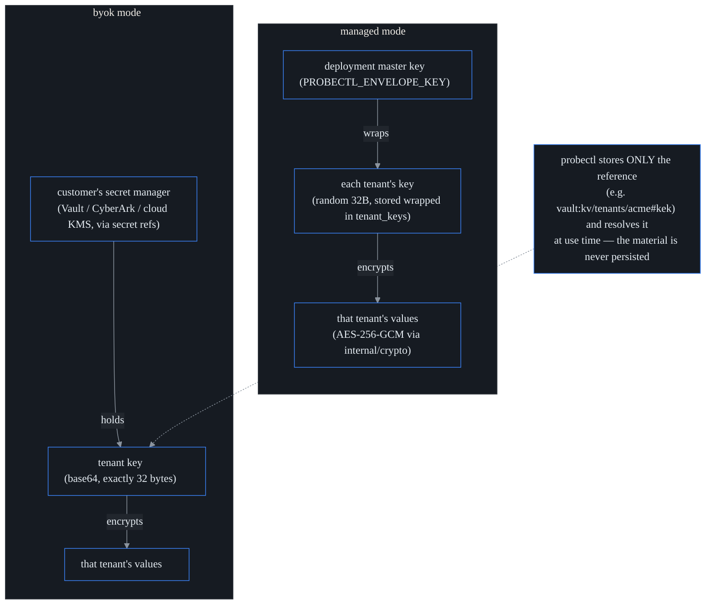

# Per-tenant key isolation / BYOK

**What this is.** probectl can encrypt each tenant's sensitive at-rest values
under that tenant's **own** encryption key. That makes tenants cryptographically
separable — even with raw database access, you cannot read tenant A's sealed
data without tenant A's key — and it turns offboarding into a
**key-destruction** event: destroy the key, and any sealed data that ever
lingers in a backup becomes permanently unreadable.

Think of it as the cryptographic complement to siloed storage (see
[isolation.md](isolation.md)): silos separate *where* a tenant's data lives;
per-tenant keys separate *who can ever decrypt it*. **BYOK** ("Bring Your Own
Key") is the stronger variant where the key lives in *your* secret manager and
probectl never holds it.

**Edition.** This lives under `ee/` (the commercial tree) and is unlocked by the
`byok` license feature (Enterprise tier; MSP crypto-offboarding consumes it too).
Without the license, deployments keep the deployment-wide envelope key (below)
and the `/v1/security/keys` API surface stays hidden — it returns 404, not a
locked-feature error.

## The sealing model

Every sensitive tenant-owned value passes through one core seam,
`internal/tenantcrypto`. (Today that means alert-channel secrets — webhook HMAC
keys, integration tokens; the set grows consumer-by-consumer, not by changing the
mechanism.) "Sealing" is authenticated encryption: the value goes into the
database as ciphertext that detects tampering, not merely hides content. Stored
values are **self-describing** — a short prefix tells the reader exactly how
the value was sealed:

| Stored prefix | Sealed by | Notes |
|---|---|---|
| *(none)* | nothing (legacy / dev plaintext) | read as-is; re-sealed on the next write |
| `dv1:` | the **deployment envelope** — one master key (`PROBECTL_ENVELOPE_KEY`) | the default whenever an envelope key is configured |
| `tk1:<version>:` | the **per-tenant keyring** (this feature) | the tenant id and key version are bound into the AEAD |

Because reads dispatch on the prefix, turning on per-tenant keys **never migrates
existing data**: old `dv1:` rows keep decrypting (the deployment sealer stays
registered as an opener), and new writes seal under the tenant key. Backward
compatibility is structural, not a migration step you have to run.

**The fail-safe rule (non-negotiable).** Once a value is sealed under a tenant
key, opening it requires *that* key. An unavailable, unresolvable, or destroyed
key is an **error** — never a silent fallback to the deployment master or any
shared key. (A recognized sealed prefix with no installed sealer also refuses to
pass through as plaintext, so a misconfiguration cannot leak ciphertext as if it
were cleartext.)

## Key hierarchy

In **managed** mode probectl generates a random 32-byte key per tenant, encrypts
("wraps") it under the deployment master key, and stores the wrapped form in the
`tenant_keys` table. "Wrapping" is encryption applied to a key: the master acts
as a **KEK** — a key-encryption key, whose only job is to lock up other keys —
so the database holds tenant keys the way a bank vault holds safe-deposit
boxes: physically inside, but each one openable only with its own key. In
**BYOK** mode the key lives in your secret manager; probectl stores only the
*reference* and resolves it at use time.

A tenant's first seal **auto-provisions** a managed v1 key. The encryption binds
`tenant:<id>:<caller-context>:v<version>` as additional authenticated data (AAD)
into every ciphertext — AES-256-GCM is an **AEAD** ("authenticated encryption
with associated data"): decryption recomputes an integrity check that covers
both the ciphertext *and* that AAD label, so a sealed blob cannot be replayed
into another tenant's row even by a direct database write — the decrypt would
fail the authenticity check.

## Rotation (no downtime)

`POST /v1/security/keys/rotate` (requires the `security.keys` permission,
admin-seeded):

- `{"mode": "managed"}` — mint a new wrapped key as version N+1.
- `{"mode": "byok", "byok_ref": "vault:kv/tenants/acme#kek"}` — activate BYOK
  against the given reference.

The previous version is **retired, not destroyed**: new data seals under the new
version immediately, while existing data keeps decrypting under the version it was
written with. There is no re-encryption pass and no downtime. (Bulk re-wrap of old
rows is deliberately deferred — values re-seal naturally on their next write.)

**The BYOK lockout guard.** A `byok_ref` is probe-resolved **before** activation:
a dead reference is rejected, so you cannot rotate yourself into a key probectl
cannot reach. After activation, though, **you own the lock**. If you later revoke
probectl's access to the reference (or delete the secret), your sealed data
becomes unreadable and sealing fails — that is the *feature*, not a bug, and there
is no recovery path through probectl. Document your secret manager's own
backup/escrow policy accordingly.

## Cryptographic offboarding

Tenant erasure destroys the tenant's entire key chain **before** the deletion
attestation is sealed: every version's wrapped key is nulled and the chain's
state set to `destroyed`. The `tenant_keys` rows survive as evidence, but
material-free. Any `tk1:` ciphertext that ever escaped into a backup window is
now permanently unreadable.

The deletion attestation carries a `tenant_keys` line recording how many key
versions were crypto-shredded (**crypto-shredding**: destroying the only key is
equivalent to shredding every copy of the data at once — including copies in
backups and snapshots you can no longer enumerate or reach). Deployments
*without* the `byok` feature record "no per-tenant keyring installed" — stated
honestly, never implied. Destroyed chains refuse re-keying: a destroyed tenant
cannot silently get a fresh v1 by writing new data.

## API and UI surfaces

- `GET /v1/security/keys` — the key chain (version / mode / state / timestamps).
  Key **material never crosses this API** in either direction.
- `POST /v1/security/keys/rotate` — managed rotation or BYOK activation.
- Tenant **Admin → Encryption keys** card: chain state, managed rotation, BYOK
  activation. Hidden entirely when unlicensed.
- Rotations are audited (`security.key_rotate`, in the tenant audit stream).

## Configuration

| Key | Meaning |
|---|---|
| `PROBECTL_ENVELOPE_KEY` | base64 32-byte deployment master key. Required for `dv1` sealing, and (as the wrap root) for managed per-tenant keys. A licensed BYOK deployment **must** still set it. |
| `PROBECTL_ENVELOPE_KEY_ID` | key identifier recorded in `dv1` values (default `dev`). |
| Secret backends | BYOK references resolve through the **same resolver** as every other secret reference — `vault:`, `cyberark:`, `aws:`, `azure:`, `gcp:` (see [secrets.md](secrets.md)). |

## Operational notes

- **Deployment-envelope rotation:** `PROBECTL_ENVELOPE_OPENER_KEYS` is only the
  overlap phase. Complete rotation with `probectl-control envelope-rewrap`, then
  remove the retired opener and run
  `probectl-control envelope-rewrap --verify-retired-key-id=<old-id>`. Rewrap or
  expire old `.pbk` backups with `probectl-control backup-rewrap` before
  destroying the old deployment KEK.
- **Key cache:** unwrapped or resolved keys are cached in memory for 30 seconds
  (rotation and destroy purge the tenant's cache immediately). A BYOK revocation
  therefore takes effect within seconds, not at the next session.
- **Key-store outage:** if Postgres is unavailable for the `tenant_keys` table,
  seal and open fail with an error (fail safe). Telemetry ingestion is
  unaffected — only sealed-value reads/writes (e.g. using an alert-channel
  secret) degrade.
- **What is NOT per-tenant-keyed:** the bulk telemetry stores
  (ClickHouse / TSDB) rely on isolation-model separation plus verifiable deletion
  at offboarding; per-tenant keys cover the *sensitive-value* class. Extending
  coverage to another data class is a consumer-by-consumer decision through the
  same seam.
