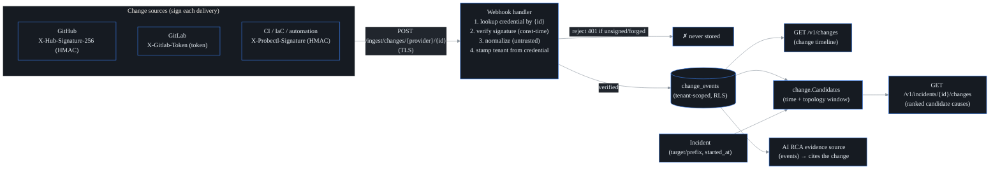

# Change intelligence + change-to-incident correlation

**What this is.** Most outages have a human cause: someone deployed, changed a
config, flipped a route, or ran a Terraform apply. probectl pulls those *change
events* in from the systems that already record them (GitHub, GitLab, CI, IaC
tools), normalizes them into one shape, keeps a per-tenant **change timeline**,
and **correlates** recent changes to incidents — so the AI root-cause analysis
(RCA) can answer the one question that resolves most outages: **"what changed?"**

A change event is **context, not an alarm.** A deploy is a *candidate cause* —
surfaced and ranked when an incident opens nearby in time and topology. It is
never raised as an alert on its own. (That keeps this on the right side of the
"detection is a signal, not an action" guardrail.)

It lives in `internal/change` (pure: no datastore/bus/HTTP-server dependency, so
the normalizers and the correlator are independently testable), with the inbound
HTTP receiver in `internal/control` (`change.go`).

## Security model (the webhook is an inbound attack surface)

A webhook is an unauthenticated POST from the public internet that ends up
feeding the RCA. So every inbound delivery is treated as **untrusted** and must
clear all of these before anything is stored (this is guardrail 12 — verified,
authenticated, untrusted ingestion — applied to a new surface):

- **TLS.** The API (and the shipped compose/Helm) are HTTPS-only.
- **Per-provider signature verification.** The sender's HMAC (GitHub / probectl's
  generic scheme) or shared token (GitLab) is verified in **constant time**
  against that webhook's configured secret. An unsigned or forged delivery is
  rejected with `401` **before** the body is parsed, so a forged change can never
  reach the timeline or the RCA. (`change.go`: `p.Verify(...)` → `apierror.Unauthorized`.)
- **Tenant binding.** The tenant is taken from the **verified credential**, never
  from the payload. The generic wire schema deliberately has *no* `tenant_id`
  field (`provider.go`: `genericEvent`), so there is nothing to spoof; injecting
  another tenant's change would require that tenant's webhook secret, which fails
  the HMAC. One tenant therefore cannot inject another's change events.
- **Size-limited, validated parse.** Bodies are capped at 1 MiB
  (`changeWebhookMaxBody = 1 << 20`) and malformed entries are dropped, not
  stored.

All cryptographic checks route through `internal/crypto` (`crypto.Verify`,
`crypto.ConstantTimeEqual`) — never a direct `crypto/hmac` call — so a FIPS module
swaps in cleanly (guardrail 3).

## Pipeline



## The ChangeEvent model

Every source is normalized onto one record (`internal/change.Event`): an `id`,
`source`, `kind` (`deploy` / `config` / `route` / `iac` / `commit` / `release` /
`other`), `title` / `summary`, a correlation **`target`** (host / service / IP)
and/or **`prefix`** (CIDR), `actor`, `ref` (commit / deploy id), `url`, free-form
`attributes`, and `occurred_at`.

`target` and `prefix` are the anchors that tie a change to an incident — they are
what the correlator matches on. A change with neither anchor can still appear on
the timeline, but it can only correlate to an *untargeted* incident (see below).

## Providers & signatures

| Provider | `provider` | Signature header | Scheme | Events normalized |
| -------- | ---------- | ---------------- | ------ | ----------------- |
| **probectl / CI / IaC** | `generic` | `X-Probectl-Signature: sha256=<hmac>` | HMAC-SHA256 | probectl change schema (a single object, an array, or `{"events":[…]}`) |
| **GitHub** | `github` | `X-Hub-Signature-256: sha256=<hmac>` | HMAC-SHA256 | `push` → commit; `deployment` / `deployment_status` → deploy |
| **GitLab** | `gitlab` | `X-Gitlab-Token: <token>` | shared token (constant-time) | `Push Hook` → commit; `Deployment Hook` → deploy |

The **generic** provider is the path for network-automation / CI / Terraform /
Atlantis: it accepts probectl's own schema and carries an explicit correlation
`target` or `prefix`, so a deploy can be tied to the host or netblock it touched.
GitHub and GitLab demonstrate heterogeneous normalization — for example, a
deploy's `environment_url` host becomes the correlation target.

### Sending a generic change

```
POST /ingest/changes/generic/<webhook-id>
X-Probectl-Signature: sha256=<hmac-sha256(secret, body)>

{"kind":"deploy","title":"deploy payments-api to prod",
 "target":"api.example.com","actor":"ci","ref":"abc123"}
```

A verified delivery returns `202 Accepted` with the count ingested
(`{"accepted": <n>}`). A verified-but-empty delivery (e.g. a GitHub ping) is not
an error — it stores zero events.

## Correlation (avoid drowning in changes)

The hard part of "what changed?" is *not* collecting changes — it is **not**
burying the operator under every deploy that happened that day. `change.Candidates`
(in `correlate.go`) scores each recent change as a candidate cause of an incident,
combining two signals:

- **Topology proximity.** Exact target match scores highest (`1.0`), then
  IP-inside-the-incident's-prefix (`0.8`), then overlapping prefixes (`0.7`).
- **Time proximity.** A change at the incident's start time scores `1.0`; one a
  full window earlier scores ~`0`. The blended score is `0.6 * topology +
  0.4 * recency`.

Only changes within the configured window *before* the incident are considered —
plus a **5-minute skew grace** (`correlationSkew`) so a near-simultaneous deploy
logged a moment *after* the incident still correlates (clocks differ across
sources). A change that neither matches a targeted incident nor falls in the
window is **dropped**. The result: the RCA is fed the few likely causes, not the
firehose.

`GET /v1/incidents/{id}/changes` returns the ranked candidates for one incident
(permission `incident.read`). The handler loads the incident, fetches changes
since `started_at - window`, and runs `change.Candidates`.

## Feeding the RCA

Change events are wired in as the AI engine's **events evidence source**
(`changeEventsSource` in `change.go`). The planner already routes
deploy/config/routing questions ("what changed?", "any recent deploy?") to the
events domain, so the RCA retrieves the relevant change for the question's
subject and **cites it** — within the caller's tenant and authorization scope.
That scope is enforced twice: the source opens an RLS transaction for the
*principal's* tenant (passed by the engine, never read from the query), and the
RCA path requires the `events.read` + `ai.query` permissions. The plain timeline
read (`GET /v1/changes`) requires `change.read`.

## Configuration

Webhooks are configured by the operator (mirroring the OTLP token model). Each
entry maps a public webhook **id** (the URL selector) to a tenant + provider +
secret.

| Variable | Default | Description |
| -------- | ------- | ----------- |
| `PROBECTL_CHANGE_WEBHOOKS` | (none) | comma-separated `id:tenant:provider:secret` credentials. The secret is the last field (so it may contain `:`, just not `,`) — use URL-safe (hex / base64) secrets. |
| `PROBECTL_CHANGE_CORRELATION_WINDOW` | `24h` | how far before an incident a change is considered a candidate cause |

The webhook **id** is a non-secret URL selector; the **secret** is the HMAC key /
shared token. Provision a distinct id + secret per tenant. Secrets are runtime
config (inject from a secret manager) — never commit them.

## Security guardrails upheld

- **Untrusted + signature-verified + TLS + tenant-scoped** ingestion; a forged or
  unsigned event is rejected before normalization (guardrail 12).
- **Tenant binding** to the verified credential — cross-tenant injection is
  structurally impossible (guardrail 1).
- **Signal, not action.** Changes are context fed to the RCA, not alarms, and
  trigger no remediation (guardrails 8, 9).
- **FIPS crypto abstraction.** HMAC + constant-time compare route through
  `internal/crypto` (guardrail 3).
- **Audited.** Each ingest appends a tenant audit event (`change.ingest`).

## Out of scope (deferred)

Self-service webhook registration (DB-backed, envelope-encrypted secrets) for the
multi-tenant / MSP case; bus publication of `probectl.change.events` for
cross-plane replay; non-webhook collectors (a BGP-derived route-change collector,
a network config-diff collector) — the `Provider` interface is the extension seam
for these. Topology what-if (the impact-preview the RCA can reach for) is covered
in `docs/topology.md`.
