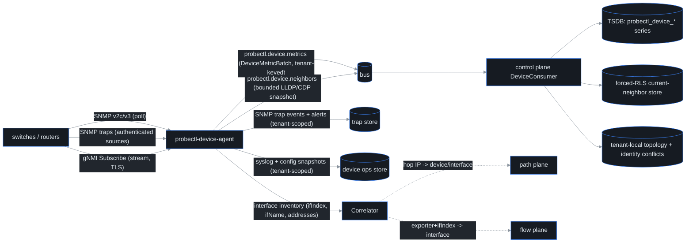

# Device / streaming telemetry — SNMP + gNMI

## What it is

The **device plane** is probectl's "how are the switches and routers themselves
doing?" layer — the interface counters, link states, CPU, memory, and
temperatures that a tool like LibreNMS watches. A network can look healthy from
the *outside* (your synthetic probes pass) while a switch is quietly dropping
packets on one port or running hot. This plane reads that truth straight from
the gear.

One agent, `probectl-device-agent`, talks to network devices through four
operator-owned paths:

- **SNMP** (the Simple Network Management Protocol, v2c or v3) — the agent
  *polls*: every interval it asks the device a
  list of questions ("what's your uptime? how many bytes has port 7 sent?").
  The questions come from **MIBs** (Management Information Bases — the
  published catalogs of what a device can answer), and each question has an
  **OID** — its numeric address in that catalog (sysUpTime lives at
  `.1.3.6.1.2.1.1.3.0`). A configured SNMP target may separately opt in to
  bounded LLDP/CDP physical-neighbor table walks.
- **gNMI / OpenConfig** (the gRPC Network Management Interface, speaking the
  vendor-neutral OpenConfig path schema) — the agent *subscribes*: the device
  *streams* updates as
  they change, over a gRPC channel.
- **SNMP traps** — the agent *listens* for device-pushed events such as link
  up/down and cold start. Traps are off by default and accepted only from
  configured sources with a matching v2c community or authenticated v3 USM user;
  accepted traps become tenant-scoped event and alert rows.
- **Syslog and config archive** — authenticated control-plane APIs let an
  operator or owned collector submit device syslog lines and versioned network
  configs. Rows are tenant-bound at write/read time; configs are redacted before
  storage and versioned with a content hash so drift is explicit.

The shape difference is a nurse doing rounds versus a wearable monitor: SNMP
takes vitals on a schedule; gNMI reports the moment something changes.

Either way, both transports are normalized into a single `DeviceMetric` with the
**same metric names**, published to the bus, and landed in the time-series
database (TSDB) by the control plane — where alerts, the AI query engine, and
dashboards see them exactly like every other series.


```mermaid
%%{init: {'theme':'base','themeVariables':{'background':'#0d1117','primaryColor':'#161b22','primaryTextColor':'#e6edf3','primaryBorderColor':'#3b82f6','lineColor':'#8b949e','secondaryColor':'#21262d','tertiaryColor':'#0d1117','clusterBkg':'#161b22','clusterBorder':'#30363d','fontFamily':'ui-monospace, SFMono-Regular, Menlo, monospace'},'flowchart':{'curve':'basis','nodeSpacing':55,'rankSpacing':55,'padding':12}}}%%
flowchart LR
  D[switches / routers] -- "SNMP v2c/v3 (poll)" --> A[probectl-device-agent]
  D -- "SNMP traps (authenticated sources)" --> A
  D -- "gNMI Subscribe (stream, TLS)" --> A
  A -- "probectl.device.metrics (DeviceMetricBatch, tenant-keyed)" --> B[(bus)]
  A -- "probectl.device.neighbors (bounded LLDP/CDP snapshot)" --> B
  A -- "SNMP trap events + alerts (tenant-scoped)" --> E[(trap store)]
  A -- "syslog + config snapshots (tenant-scoped)" --> O[(device ops store)]
  B --> P[control plane DeviceConsumer]
  P --> T[(TSDB: probectl_device_* series)]
  P --> N[(forced-RLS current-neighbor store)]
  P --> I[(tenant-local topology + identity conflicts)]
  A -- "interface inventory (ifIndex, ifName, addresses)" --> C[Correlator]
  C -. "hop IP -> device/interface" .-> PathPlane[path plane]
  C -. "exporter+ifIndex -> interface" .-> FlowPlane[flow plane]
```

## How it works — one model, two transports

The trick that keeps everything downstream simple: **SNMP and gNMI emit the same
metric names**, so an alert rule or dashboard never has to care which transport
fed it. (Source of truth: `internal/device/model.go`.)

| Metric | Source (SNMP) | Source (gNMI/OpenConfig) | Unit |
| --- | --- | --- | --- |
| `probectl.device.uptime.seconds` | sysUpTime | — | seconds |
| `probectl.device.if.oper.status` | IF-MIB ifOperStatus | `state/oper-status` | 1 up / 0 not |
| `probectl.device.if.speed.mbps` | ifHighSpeed | — | Mbps |
| `probectl.device.if.{in,out}.octets` | ifHC{In,Out}Octets | `state/counters/{in,out}-octets` | octets (cumulative) |
| `probectl.device.if.{in,out}.{errors,discards}` | ifTable | `state/counters/...` | packets |
| `probectl.device.cpu.utilization` | hrProcessorLoad (avg) | — | percent |
| `probectl.device.memory.{used,total}.bytes` | hrStorageTable (RAM row) | — | bytes |
| `probectl.device.sensor.temperature.celsius` | ENTITY-SENSOR (opt-in) | — | °C |

These names live in the `probectl.device.*` namespace deliberately. probectl maps
its signals onto OpenTelemetry semantic conventions wherever a standard exists,
but **no OTel convention covers network-device telemetry**, so this is one of the
few places probectl owns the names. In the TSDB they become `probectl_device_*`
with labels `tenant_id, agent_id, device, device_name, source, if_index,
if_name` (`source` is `snmp` or `gnmi`). SNMP interface samples also carry
their normalized interface addresses in the tenant-keyed protobuf bus payload.
Those addresses rebuild local topology/correlation evidence during replay; they
do not become high-cardinality TSDB labels.

The agent also keeps a tiny in-process correlation cache so a path hop or flow
exporter can be explained as "this device/interface." That cache is not the
source of metric history; it is a derived identity read model. Stale sysName and
interface labels age out via `PROBECTL_DEVICE_CORRELATION_RETENTION` (default
`2160h`, `0` disables) so old labels stop matching after the configured window.

**Why one model matters:** a counter like "interface 7 out-octets" should look
identical whether a 15-year-old switch coughed it up over SNMP or a modern box
streamed it over gNMI — two thermometers, one chart column. Unifying at the
*metric* layer means the rest of the
platform — alerting, AI, correlation — is written once.

### Graceful degradation over MIB variance

Not every device exposes every table. A cheap access switch may have no
HOST-RESOURCES MIB (so no CPU/memory), or no sensor table. probectl handles this
with **independent, best-effort table walks**: each walk fails on its own, so a
device that lacks HOST-RESOURCES simply yields no CPU/memory samples — the rest
still flow. Think of a survey whose sections are each optional: a skipped
section yields blanks, not a voided form — only an unreachable respondent
voids it. Only an unreachable or mis-authenticated device (the system group
itself fails) fails the whole poll. You get partial truth instead of an all-or-
nothing error.

## Built-in evidence-budget profiles

`collection_profile` is a tiny compiled vocabulary for choosing how much
read-only evidence the agent asks each already-configured device to provide. It
does not download a MIB catalog, load plugins, discover targets, try
credentials, or enable a new protocol. Think of it as three factory-set
flashlight brightness levels over collectors already in the binary:

| Profile | SNMP cadence and optional walks | gNMI cadence and paths |
| --- | --- | --- |
| `minimal` | 5m; base system/interface/address/CPU/memory walks; no sensors or neighbors | 2m; interface operational status |
| `standard` | 1m; base walks; no sensors or neighbors | 30s; interface counters + operational status |
| `topology-rich` | 1m; base walks + temperature sensors + bounded LLDP/CDP | 30s; interface counters + operational status |

All profiles are local, deterministic, and bounded. `topology-rich` adds
adjacency only for SNMP targets because the current gNMI collector does not own
a topology path. It does not manufacture equivalent evidence.

A target may change a profile value only under `collection_overrides`; mixing a
profile with the legacy top-level `interval`, `sensors`, `neighbors`,
`gnmi.sample_interval`, or `gnmi.paths` keys fails configuration validation.
This makes an override visible during review instead of silently winning by
parse order. SNMP interval overrides are bounded to 15s–24h. gNMI sample
overrides are bounded to 5s–1h, and profile-mode paths are limited to the two
compiled OpenConfig paths above. Existing configurations without
`collection_profile` keep their prior explicit behavior.

```yaml
collection_profile: topology-rich
devices:
  - address: 192.0.2.10
    transport: snmpv3
    credential: core-ro
    collection_overrides:
      interval: 90s
      sensors: false
      neighbors: true
```

Review the exact effective plan before startup:

```bash
probectl-device-agent config-check -config /etc/probectl/device-agent.yaml
probectl device profiles
probectl device config-preview --config /etc/probectl/device-agent.yaml
```

The preview validates and expands the file but constructs no secret resolver,
bus, runtime, or network client. It includes target addresses, cadence, and
walk/path names, but excludes tenant identity and credential names/material.
Admin → Register collector exposes the same three profiles and returns the
selected `PROBECTL_DEVICE_PROFILE` / `collection_profile` hint. That selection
is not centrally persisted; the deployed local config remains authoritative.

## Physical adjacency — direct LLDP/CDP evidence

Metrics say how a port feels; LLDP/CDP says which port is plugged into which
neighbor. On an already-configured SNMP target, `neighbors: true` enables
read-only walks of the standard LLDP-MIB and CISCO-CDP-MIB through the same
authenticated session used for metrics. Each normalized row carries:

- tenant-bound agent and local device identity;
- local interface index and port;
- remote chassis/name, port, management address, platform, and capabilities
  when the device supplies them;
- protocol (`lldp` or `cdp`), observed time, fresh-until time, and confidence.

The row is an observation, not a guess. The control plane persists it before
acknowledging the bus message, then folds a `physical` edge into only that
tenant's topology. A remote management address is used as the remote node when
present; otherwise the protocol/chassis identity remains distinct. There is no
automatic identity merge and no invented IP.

Bounds keep one noisy device from becoming the product: 256 neighbors per
device snapshot, 16,384 retained rows per tenant, 500 rows per API read, and a
24-hour stale-evidence window. Each new source snapshot replaces the prior
current rows for that agent/device. Unsupported MIBs are an honest empty
snapshot, not an error and not synthetic topology.

Operators see the same evidence in **Planes → Device**, as `physical` edges and
coverage on **Topology**, through `GET /v1/device/neighbors`, or with
`probectl device neighbors`. Every surface distinguishes current, stale,
future/unknown, unavailable, empty, and truncated states.

Every neighbor-enabled target also emits a separate, versioned collection
receipt after each authoritative LLDP and CDP attempt on
`probectl.device.collection-outcomes`. The receipt is deliberately separate
from `probectl.device.neighbors`: a failed walk therefore cannot replace
last-known-good adjacency with an apparently healthy empty snapshot. Its stable
states are `ok_with_rows`, `healthy_empty`, `unsupported`, `failed`, and
`never_observed`; stable reason and next-action codes explain which one applies.
Only the configured target, agent, protocol, attempt/success times, row count,
and allowlisted codes are carried. Credentials, raw varbinds, discovered
neighbors, and free-form errors are excluded.

The forced-RLS current-receipt store keeps at most 4,096 target/protocol rows
per tenant for 30 days, and reads return at most 500. Operators see the same
tenant-audited contract in **Planes → Device**, **Admin → Device collection
readiness**, `GET /v1/device/collection-outcomes`, generated SDKs, and
`probectl device outcomes`. The support bundle includes the same states using
bundle-local `agent-NNNN` and `target-NNNN` references, never raw identifiers.

This is intentionally narrow. It does not scan a subnet, probe discovered
addresses, open a CLI/SSH session, fetch from a vendor service, mutate a device,
or infer bridge FDB, ARP/ND, or STP relationships. Those later evidence types
would require a separately reviewed scope.

## Correlation — tying device interfaces to the other planes

A device interface is the join point between planes — the way a flight number
joins the departure board, the baggage belt, and the crew roster. Each SNMP
poll also builds
an **interface inventory**: for every interface, its `ifIndex` (the interface's
numeric slot on the device — the same number flow exports use), its `ifName`
(falling
back to `ifDescr`), and the IP addresses from `ipAddrTable`. The
`device.Correlator` then joins the other planes on it:

- **path hop → interface**: a traceroute responder IP matches an interface
  address (or the device's management address gives a device-level match) — so a
  slow hop in a path test becomes "this hop is `core-sw1`".
- **flow → interface**: a flow record's `(exporter address, ifIndex)` pair
  matches the exporting device's named interface — turning the opaque
  "ifIndex 7" in a flow export into "`core-sw1` eth7".

This is what lets a cross-plane incident say *"the path test slowed at the same
interface where the flow plane sees a traffic spike and the device plane sees
rising discards"* — one interface, three views.

### When identity sources disagree

SNMP and gNMI do not always agree. A replacement device may reuse an address, an
interface may be renamed, or two inventories may claim the same interface
address. A normal graph-label upsert would keep only the newest string, making
the disagreement invisible. probectl therefore records the bounded normalized
claim **before** updating the display label.

The local identity index detects five conflict shapes:

- one device name claimed by competing management addresses;
- one management address claimed with competing device names;
- one interface address claimed by competing devices;
- one `(device address, ifIndex)` claimed with competing interface names;
- one `(device address, interface name)` claimed with competing indexes.

`GET /v1/device/identity-conflicts` exposes those records with the source,
tenant-bound agent, first/last observation time, age, evidence basis, competing
values, and the path/flow/topology correlations that could be wrong. The read is
bounded to 200 response rows; the tenant-local store is capped at 1,024 identity
keys, eight provenance claims per key, 64 interface addresses per observation,
and 512 Unicode characters per normalized identity field. Truncation is
explicit. Future-clock evidence is `unknown`, old disagreement is `stale`, and
two fresh distinct sources are an `active` high-confidence conflict.

The same native review card appears under **Planes → Device** and **Topology**,
and the CLI path is `probectl device conflicts`. It is intentionally
observe-only: the proposal says what a human should verify, while
`merge_supported:false` guarantees the API has no merge/remediation operation.
Correct the authoritative producer or inventory outside probectl, then let
retention remove the losing claim. No external identity service, geolocation,
or outbound lookup participates.

## Discovery and import review

The device agent can also run a **review-only discovery job**:

```bash
./bin/probectl-device-agent discover -job discovery.json -out review.json
```

Discovery is intentionally shaped like a flashlight, not a bulldozer. A job must
name one tenant, one or more **safe IPv4 ranges**, and one or more tenant-owned
credential references. Safe means private RFC1918, loopback, or link-local; a
public range such as `8.8.8.0/24` is rejected before any probe runs. Jobs also
have a `max_hosts` ceiling (default `1024`) so a typo cannot become a broad
scan.

Example job:

```json
{
  "id": "edge-rack-01",
  "tenant_id": "t-acme",
  "created_by": "netops@example.com",
  "ranges": ["10.10.40.0/28"],
  "max_hosts": 14,
  "credentials": [
    {"tenant_id": "t-acme", "name": "core-ro", "transport": "snmpv2c"}
  ],
  "classifier_rules": [
    {"role": "edge-router", "sys_name_contains": ["edge"], "confidence": 0.9},
    {"role": "access-switch", "sys_descr_contains": ["switch"], "min_interfaces": 8}
  ]
}
```

Credential entries are names only. The same `PROBECTL_DEVICE_CRED_<NAME>_*`
environment or secret-reference resolver used by normal polling resolves the
material at probe time. If a credential name is wrong or belongs to a different
tenant than the job, discovery fails closed.

Each answering device is classified from SNMP evidence: `sysName`, `sysDescr`,
and interface names/descriptions. Operator classifier rules run first; built-in
fallbacks label obvious routers, switches, and firewalls conservatively. The
output is a **review JSON** with `status: "review_required"` and each device in
`activation_state: "pending_review"`. In other words, discovery can suggest
targets, but it cannot activate monitoring by itself. An explicit review step
turns accepted candidates into ordinary device-agent `devices:` targets, and the
result carries audit events for job start, device discovery, review required,
and per-device approval.

For demos and tests, `-fixture fixture.json` drives the same workflow without
touching the network:

```json
{
  "devices": [
    {
      "address": "10.10.40.2",
      "sys_name": "edge-r1",
      "sys_descr": "router os",
      "interfaces": [
        {"index": 1, "name": "wan0", "oper_up": true, "addrs": ["10.10.40.2"]}
      ]
    }
  ]
}
```

## Credentials — referenced by name, never stored

Device credentials (SNMP communities, SNMPv3 passphrases, gNMI passwords) are
secrets, and probectl treats them like the guardrails demand: **config files
reference a credential by *name* only** — the secret material itself is resolved
at runtime through `device.CredentialSource` and is **never written to config or
git, and never logged** (the `Credential` type's `String()`/`GoString()` render
as `credential(redacted)`). Think coat check: the config holds only the
ticket; the cloakroom — the environment today, a secrets backend later — holds
the coat.

The default source reads the environment. For a credential named `core-ro`
(uppercased, with `-`/`.` mapped to `_`):

```text
PROBECTL_DEVICE_CRED_<NAME>_COMMUNITY      # SNMP v2c
PROBECTL_DEVICE_CRED_<NAME>_USERNAME       # SNMP v3 / gNMI metadata auth
PROBECTL_DEVICE_CRED_<NAME>_AUTH_PROTO     # sha (default) | sha256 | sha512 | md5
PROBECTL_DEVICE_CRED_<NAME>_AUTH_PASS
PROBECTL_DEVICE_CRED_<NAME>_PRIV_PROTO     # aes (default) | aes256 | des
PROBECTL_DEVICE_CRED_<NAME>_PRIV_PASS
  PROBECTL_DEVICE_CRED_<NAME>_PASSWORD       # gNMI metadata auth
```

A credential name that resolves to *nothing* **fails closed at startup** — a
typo can't silently downgrade you to an unauthenticated poll; the agent refuses
to start instead. The named-credential seam is also the integration point for a
real secrets backend (Vault, CyberArk, a cloud KMS) plugging in later without
touching any device config.

## Syslog and config archive

The device operations surface covers two NMS/NCM table-stakes workflows without
turning probectl into a vendor-managed collector:

- `POST /v1/device/syslog` accepts one authenticated syslog line for the caller's
  tenant. The parser extracts PRI facility/severity and common host/app fields
  when present, but preserves the original line for investigation. `GET
  /v1/device/syslog` reads only the caller tenant's rows, with optional `device`
  and bounded `limit` filters.
- `POST /v1/device/configs` archives one device config version for the caller's
  tenant. Common secret-bearing lines (`password`, `secret`, `community`,
  `token`, keys) are redacted before storage; the stored content hash and
  previous hash produce an explicit drift flag on version 2+. `GET
  /v1/device/configs` lists the tenant's config versions, newest first.

The native **Planes → Device → Config archive** can compare a changed version
with its exact archived predecessor. The action appears only when the selected
row's `previous_hash` matches an older, same-device `content_hash` in the
already-authorized response and both redacted contents are present. The line
comparison is deterministic, dependency-free, computed in the browser, and
bounded so a pathological config cannot freeze the page; a bounded result says
that it is incomplete. It never contacts the device, sends content to a model
or external service, invents missing history, or offers a write/rollback action.
`probectl device configs` reaches the same tenant-scoped API and returns the
same redacted contents and hash linkage for CLI/export workflows; it does not
claim a separate unredacted or device-control path.

This is intentionally **customer/MSP-owned**: use a local device agent, collector
script, or automation runner to submit syslog/config rows over the authenticated
control-plane API. probectl does not offer managed-device custody and does not
bill by line, config, byte, or device volume.

A note for **FIPS deployments**: the SNMPv3 USM (User-based Security Model —
SNMPv3's built-in authentication/encryption layer) algorithms run
inside the SNMP library — they are protocol-mandated, exactly like a TLS
handshake, not a probectl crypto path. SNMPv3's older MD5 and DES options are not
FIPS-approved, so prefer SHA-2 + AES, or use gNMI over TLS.

## gNMI transport security

gNMI always dials **TLS with certificate verification** — using the system root
store, or a private CA via `ca_file`. Verification is never disabled, and
plaintext configuration is rejected before dialing (a core guardrail: every
outbound channel validates certificates). When a credential sets a
username/password, it rides gRPC metadata only over that verified channel.

Each gNMI Subscribe response is capped at 4 MiB by an explicit client
`MaxCallRecvMsgSize`, matching the agent and OTLP gRPC safety ceiling. Hostile
or buggy devices that send an over-sized frame are rejected before normalization,
and the normalization path is covered by `FuzzGNMINormalize`.

## Configuration

See [`deploying-agents.md`](deploying-agents.md) for where the device agent
sits in the producer catalog (placement, service files, the full
producer-to-first-data path), `deploy/agent/probectl-device-agent.example.yml`
for the YAML form, and [`configuration.md`](configuration.md) for every key.
Quick start against one switch:

```bash
export PROBECTL_DEVICE_TENANT=t-acme
export PROBECTL_DEVICE_TARGET=192.0.2.1 PROBECTL_DEVICE_TRANSPORT=snmpv2c
export PROBECTL_DEVICE_CREDENTIAL=core-ro
export PROBECTL_DEVICE_PROFILE=topology-rich
export PROBECTL_DEVICE_CRED_CORE_RO_COMMUNITY=public
./bin/probectl-device-agent config-check
./bin/probectl-device-agent
```

Discovery quick start against a bounded private range:

```bash
export PROBECTL_DEVICE_CRED_CORE_RO_COMMUNITY=public
./bin/probectl-device-agent discover -job discovery.json -out review.json
```

## Testing

- The poller/normalizer is table-driven against canned-PDU fakes (a healthy
  device, degraded MIBs, an unreachable device), and the gNMI client runs against
  an in-process mock target over bufconn — both in `go test ./internal/device/...`.
- LLDP/CDP parser fixtures prove port/protocol/provenance normalization and the
  256-row cap. `TestDeviceNeighborEvidenceStorageIsTenantIsolatedAndBounded`
  exercises forced RLS and cross-tenant write/read rejection against Postgres;
  control/API tests prove persistence-before-ack, physical-edge folding,
  freshness, response bounds, and foreign-tenant invisibility.
- Discovery is pinned by fixture-network tests that classify devices, keep them
  pending review, build reviewed imports, and prove a tenant cannot list another
  tenant's discovery result.
- `TestSNMPIntegration` drives the **real** SNMP client against a live target
  when `PROBECTL_TEST_SNMP_TARGET` is set; CI starts a loopback `snmpd` target
  for it, exports `PROBECTL_TEST_REQUIRE_SERVICES=1`, and fails rather than
  skips if that target is absent. Local runs can point at lab gear or another
  simulator, or skip cleanly when the target is unset.
- The correlation contract (hop IP ↔ interface, flow exporter+ifIndex ↔
  interface) is pinned by `TestCorrelatorHopToInterface` and
  `TestCorrelatorFlowToInterface`. `TestPollSNMPHealthyDevice`,
  `TestBusEmitterTenantTaggedBatch`, and
  `TestIdentityConflictAPIIngestsCompetingSourcesAndIsTenantScoped` prove
  interface addresses survive poll → protobuf bus → tenant-local conflict
  detection.
