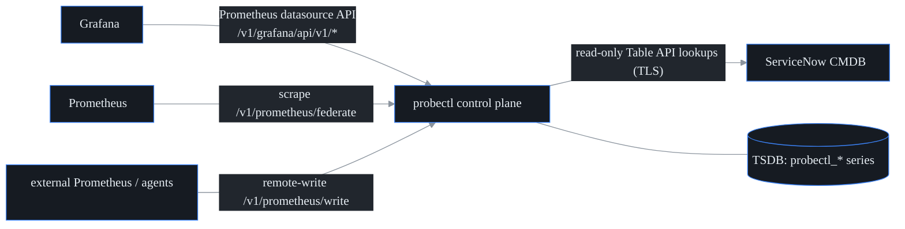

# Ecosystem integrations — Grafana, Prometheus, ServiceNow CMDB

## What this is

probectl is built to **slot into the observability stack you already run**, not
to demand you rip it out and start over. Three integrations make that real:

- **Grafana** queries probectl directly, as if probectl were a Prometheus.
- **Prometheus** either scrapes metrics out of probectl (federation) or pushes
  metrics into it (remote-write).
- **ServiceNow CMDB** correlation links probectl incidents and assets to your
  existing configuration items (CIs).

The metrics surfaces live in `internal/promapi`; the ServiceNow client lives in
`internal/cmdb`; both are wired into the control plane in `internal/control`.



## The tenant boundary (read this first)

The dangerous part of exposing a metrics query API is that a query language is
powerful enough to ask for *anyone's* data. probectl closes that hole by
enforcing **tenant first, then RBAC** on every surface here (CLAUDE.md §7):

- **Only plain series selectors are accepted** — `metric{label="value",...}`.
  PromQL functions and operators are rejected outright, because *a query probectl
  cannot fully parse is a query it cannot tenant-scope.* (The parser in
  `internal/promapi/selector.go` returns an explicit error for anything beyond a
  selector.)
- **The tenant is forced, not trusted.** Whatever `tenant_id` matcher the caller
  wrote is **removed**, and a single `tenant_id="<caller's tenant>"` equality is
  injected (`ForceTenant`). In `PROBECTL_TSDB_MODE=prometheus` mode, only the
  canonical reconstructed selector is forwarded upstream — never the caller's
  raw text.
- **Remote-write payloads are untrusted:** size/series/sample/label caps apply,
  and every incoming sample's `tenant_id` label is **forced** to the caller's
  tenant.
- **RBAC** sits on top: reads need `metrics.read`, remote-write needs
  `metrics.write`, CMDB lookups need `cmdb.read` (permissions added in migration
  `0022_metrics_cmdb_permissions.sql`).

## Grafana datasource

probectl exposes a Prometheus-compatible API subset at `/v1/grafana`, so you add
it to Grafana **as a Prometheus datasource** — no plugin to install:

1. Connections → Data sources → Add → Prometheus.
2. URL: `https://<probectl>/v1/grafana`. Set the HTTP method to POST.
3. Attach credentials for a probectl principal holding `metrics.read` (in dev
   mode, none needed).
4. "Save & test" — probectl answers Grafana's `buildinfo` and `1+1` health
   probes.

Provisioning-as-code lives at
`deploy/grafana/provisioning/datasources/probectl.yml`.

The available endpoints, all under `/v1/grafana/api/v1/`: `query`, `query_range`
(GET and form-POST, the way Grafana actually sends them), `series`, `labels`,
`label/{name}/values`, `status/buildinfo`, `metadata`. Range queries return the
**raw stored samples** in the window (no step interpolation) — use Grafana
transformations for any client-side math. The metric catalog is the
`probectl_*` namespace (results, devices, flows, BGP, threat — whatever the
pipelines land in the TSDB).

**Two modes:** with the in-memory TSDB (lightweight mode) queries evaluate
in-process; with `PROBECTL_TSDB_MODE=prometheus` the canonical selector is
forwarded to the backing Prometheus/VictoriaMetrics and the response passes
through.

## Prometheus federation (probectl → Prometheus)

`GET /v1/prometheus/federate?match[]=<selector>` serves the **latest sample**
of every matching series in the Prometheus text exposition format — drop it into
a Prometheus scrape config:

```yaml
scrape_configs:
  - job_name: probectl
    honor_labels: true
    metrics_path: /v1/prometheus/federate
    params:
      "match[]": ["{__name__=~\"probectl_.*\"}"]
    scheme: https
    static_configs: [{ targets: ["probectl.example.com"] }]
```

**Cardinality guard:** a scrape matching more than the series cap
(`DefaultMaxSeries`, 5000) **fails closed** with an explicit error rather than
melting the scraper — narrow the selector. This is the thing to watch for when
federating: an over-broad `match[]` is rejected on purpose, not silently
truncated.

## Prometheus remote-write (external → probectl)

`POST /v1/prometheus/write` accepts the standard snappy-compressed protobuf
`WriteRequest`, so an existing Prometheus (or vmagent / Grafana Alloy) can push
metrics **into** probectl:

```yaml
remote_write:
  - url: https://probectl.example.com/v1/prometheus/write
    # credentials for a principal holding metrics.write
```

Ingested samples land in probectl's TSDB tenant-tagged (the `tenant_id` is forced
to the caller's tenant on decode) and immediately become queryable and alertable
just like native series.

## ServiceNow CMDB correlation

This links probectl's view of the network to your system of record for assets.
It is **read-only**: probectl looks up CIs and never writes to the CMDB.
Configure it via environment variables:

```bash
export PROBECTL_CMDB_PROVIDER=servicenow
export PROBECTL_CMDB_URL=https://acme.service-now.com
export PROBECTL_CMDB_SECRET='integration-user:password'   # env only, never logged
# optional: PROBECTL_CMDB_TABLE=cmdb_ci  PROBECTL_CMDB_CACHE_TTL=10m
```

Surfaces:

- `GET /v1/cmdb/lookup?key=<ip|hostname>` — direct lookup.
- `GET /v1/incidents/{id}/cis` — the incident's target plus its signal targets,
  resolved tenant-scoped and correlated to CIs with deep links.
- `GET /v1/agents/{id}/ci` — asset correlation by agent hostname.

**Behavior:** lookups hit the ServiceNow Table API with an encoded disjunction
query (`ip_address=<k>^ORfqdn=<k>^ORname=<k>`), capped at 10 CIs per lookup
(`maxCIsPerLookup`), over verified TLS (the `PROBECTL_CMDB_URL` must be HTTPS).
Results — including misses — are TTL-cached, so **a down CMDB serves stale cache
and never breaks core function** (CLAUDE.md §7, rule 10). Keys are canonicalized
(case, ports, schemes), and non-keys (CIDR prefixes, free text) are dropped
before a query is ever made.

**Multi-tenant note:** the CMDB endpoint and credential are deployment-level —
one CMDB connection for the install. Correlation *requests*, however, are
tenant-scoped: a caller can only correlate its own tenant's incidents and
agents. Per-tenant CMDB configurations would ride the per-tenant secrets work
and are not part of this integration today.

## Testing

`go test ./internal/promapi ./internal/cmdb ./internal/control` covers the
strict selector grammar (including injection attempts), tenant forcing,
instant/range/labels/series evaluation, cardinality caps, federation exposition,
remote-write decode limits plus tenant forcing, the full Grafana request
sequence against a seeded TSDB (renders plus cross-tenant leak canaries), the
RBAC route declarations and their 401s, and the ServiceNow client/resolver
against an `httptest` Table-API double (cache, stale-serve, negative cache,
correlation).
