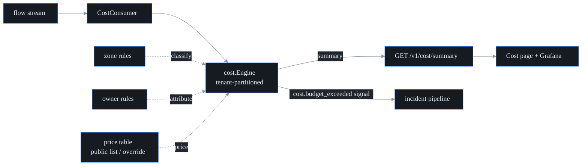

# FinOps / egress cost observability

## What this is

probectl already sees your network traffic (the flow stream). This engine puts
**dollars** on that traffic. It lives in the control plane (`internal/cost`) and
answers **FinOps** questions — FinOps being the practice of making cloud spend
visible and attributable to the teams who create it: which service or team is
spending money on the network, which conversations are crossing expensive
boundaries ("chatty services"), how cost trends hour to hour, and whether a team
is about to blow its monthly budget. Clouds bill for **egress** — traffic that
*leaves* a boundary (a zone, a region, or the provider's network entirely) —
which is why where a byte travels matters more than how many bytes there are.

The mechanism, in one line: take the bytes probectl observes, label each flow
with a **traffic class** (same zone, cross-AZ, cross-region, internet egress),
multiply the bytes by a **per-class price**, and attribute the result to a
service and team. Cheap to compute, because the bytes are already flowing.

For the cost of running probectl's own infrastructure, use
[`operating-cost.md`](operating-cost.md). This page is tenant traffic showback,
not the operator's monthly run-cost worksheet.

Three ground rules shape the whole feature:

1. **Volume × public pricing, not billing.** Cloud billing APIs differ between
   providers and lag by hours or days, so the engine prices *observed egress
   volume* against published list rates. Think of it as the taxi's own meter
   rather than your credit-card statement: it prices the distance it personally
   watched at the published tariff, so it can tell you *who rode where* in real
   time — squaring it against the invoice stays your bank's job. This is an
   attribution-and-detection tool — "who is generating cross-region traffic and
   roughly what does it cost" — not a reconciliation of your actual invoice.
   Full cloud-billing reconciliation is out of scope by design.
2. **Degrade gracefully.** With no price table, the engine runs in **volume-only
   mode**: bytes are still attributed, dollars are never invented, and
   `priced: false` is surfaced everywhere. With no zone rules, locality classes
   are `unknown` and the UI says so. It never refuses and never guesses a rate.
3. **Pricing freshness is visible.** The built-in rates are representative list
   prices from public pricing pages, carrying a source, an as-of date, and a
   license note. Operators override them with their own current or negotiated
   rates. The as-of date is always displayed, so staleness is visible rather
   than hidden.

## How traffic is classified and priced

First the flow is classified by where its two ends sit. A **zone** (an
availability zone, AZ) is one isolated datacenter within a cloud **region**;
clouds charge nothing inside a zone, a little to cross zones, more to cross
regions, and the most to reach the public internet. probectl resolves each
address to a zone/region using operator-declared **CIDR** rules — CIDR notation
names an IP address range by prefix, e.g. `10.0.1.0/24` is 256 addresses — (it
cannot guess your subnet layout), then:

| Class | Meaning | Default rate ($/GiB) |
|---|---|---|
| `same_zone` | both ends map to the same zone | 0 (free on the major clouds) |
| `inter_az` | same region, different zones | 0.01 |
| `inter_region` | different regions | 0.02 |
| `internet_egress` | source is mapped, destination is a public address | 0.09 |
| `unknown` | zones unmapped (or destination is private/unresolvable) | unpriced — volume is still tracked |

`unknown` is the honest fallback: the bytes are counted, but no dollar figure is
attached (the default price table simply has no rate for it). Classification
uses longest-prefix matching — the most specific rule wins — so a `/24` rule
beats an overlapping `/16`.

Zone and ownership maps are operator-declared. The ownership map is what makes
**showback** possible: showing each team its share of the network bill without
actually charging anyone — visibility, not invoicing:

```sh
# CIDR → zone (region is derived from the trailing zone letter, or set explicit zone/region)
export PROBECTL_COST_ZONES="10.0.1.0/24=us-east-1a,10.0.2.0/24=us-east-1b,10.9.0.0/16=eu-west-1a"
# CIDR → service:team (attribution + showback)
export PROBECTL_COST_SERVICES="10.0.1.0/24=checkout:payments,10.0.2.0/24=inventory:logistics"
# Monthly USD budgets; a breach raises ONE cost-plane signal per month
export PROBECTL_COST_BUDGETS="team:payments=500,service:checkout=120"
```

To override the prices, point `PROBECTL_COST_PRICES_FILE` at a JSON file in the
`PriceTable` shape. A malformed file **fails startup** — silently mispriced cost
data is worse than none. (To run with no pricing at all, set
`PROBECTL_COST_PRICED=false` instead.)

```json
{
  "per_gib": { "inter_az": 0.01, "inter_region": 0.02, "internet_egress": 0.08 },
  "source": "negotiated rates, FY26 agreement",
  "as_of": "2026-06-01",
  "license": "internal"
}
```

## Outputs

- `GET /v1/cost/summary` (permission `metrics.read`) — the tenant's totals,
  by-class / by-service / by-team breakdowns, the top "chatty" zone pairs, a
  7-day hourly trend, budget status, and the honesty flags (`cost_running`,
  `priced`, `zones_mapped`) plus the pricing provenance. A zone-pair
  conversation is flagged `chatty` once it crosses **1 GiB of paid cross-AZ or
  cross-region traffic** (same-zone and internet traffic do not count toward
  chatty, since the point is to surface money quietly leaking across internal
  boundaries).
- **Budget alerts** — crossing a monthly budget raises a `cost.budget_exceeded`
  signal (plane `cost`) into the incident pipeline. It fires **once per budget
  per month** (alert-fatigue control) and re-arms on month rollover. Signals
  only: probectl never throttles traffic or touches your bill — a detection is
  a signal, never an enforcement point.
- **Cost page** (`/cost`) — the light native summary: totals with pricing
  provenance, team showback, chatty cross-AZ conversations, budget status, and
  explicit volume-only / zones-unmapped notices. Deep dashboarding is federated
  to **Grafana** (see [`docs/ecosystem-integrations.md`](ecosystem-integrations.md));
  cost series ride the same flow analytics the Grafana datasource already
  exposes, so there is no separate dashboard surface to maintain.

## Mechanics



All state is tenant-partitioned — tenant isolation is the platform's outermost
boundary (see the [Non-negotiables](../CONTRIBUTING.md#non-negotiables)).
Attribution maps are bounded: once a per-tenant map hits 1024 keys, further
entries collapse into `(other)` so memory can't grow without limit. A flow
record arriving without a tenant is dropped at the boundary. The in-memory
engine is rebuilt from the stream on restart — the durable, queryable series
live in the TSDB (time-series database) / Grafana path, not in this process.

## Configuration

| Variable | Default | Purpose |
|---|---|---|
| `PROBECTL_COST_ENABLED` | `true` | the engine + flow consumer (local-only processing) |
| `PROBECTL_COST_ZONES` | (none) | CIDR→zone rules (`cidr=zone[/region],…`) |
| `PROBECTL_COST_SERVICES` | (none) | CIDR→`service:team` attribution rules |
| `PROBECTL_COST_BUDGETS` | (none) | monthly USD budgets (`team:payments=500,…`) |
| `PROBECTL_COST_PRICES_FILE` | (none) | JSON price-table override (built-in public list rates otherwise) |
| `PROBECTL_COST_PRICED` | `true` | `false` switches to volume-only mode (no pricing at all) |
