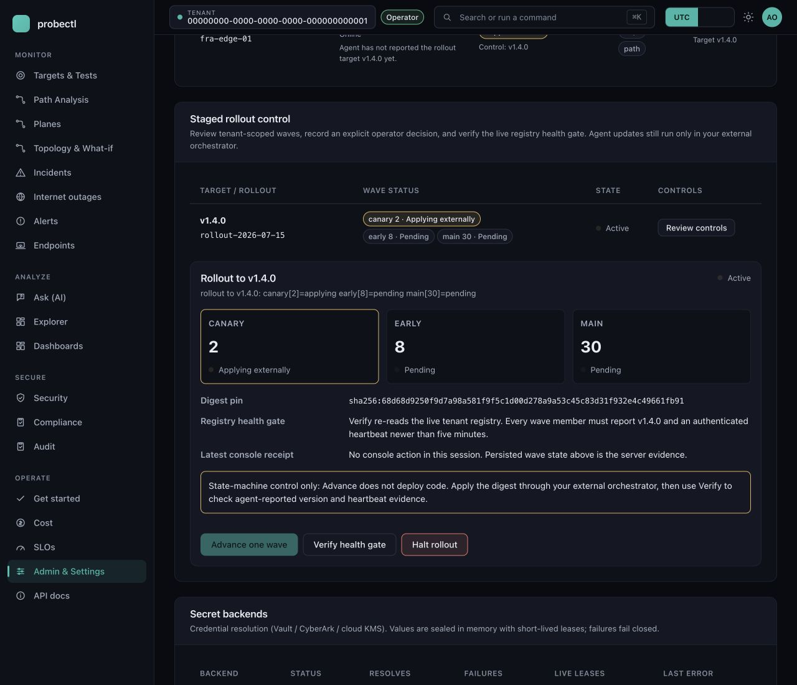
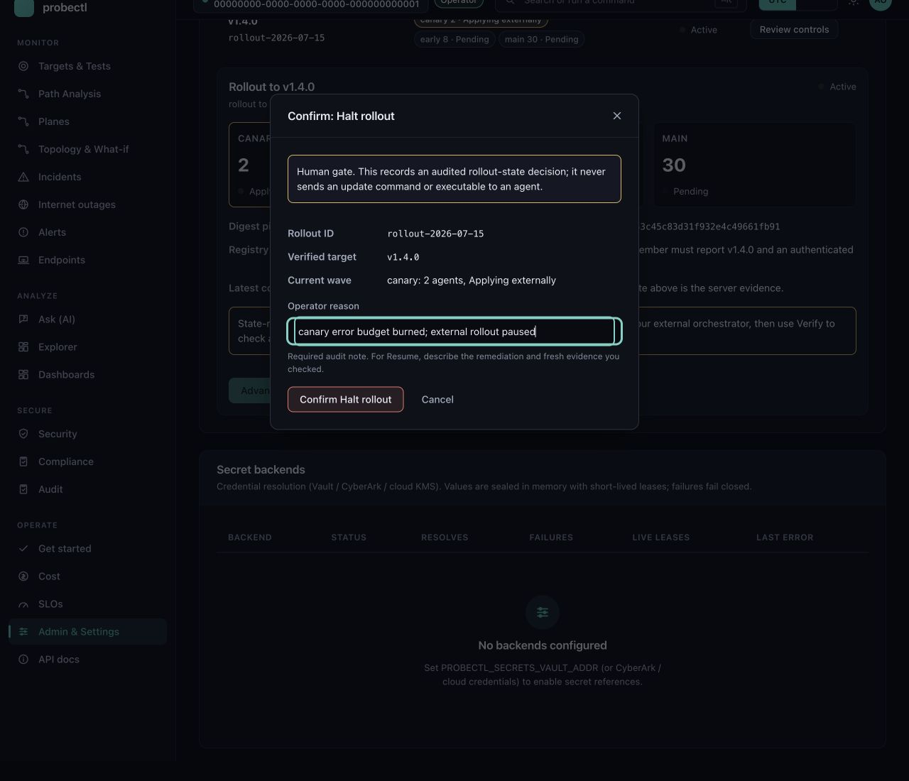
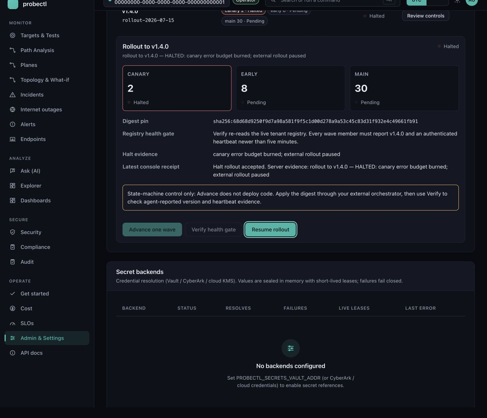

# Staged fleet rollout

## What this is

How a fleet of probectl agents moves to a new version: in **waves**, from
**verified, digest-pinned** artifacts, with the agent registry **confirming**
every wave, and any failure **halting the train**. The goal is that a bad
version reaches a small canary first and stops there, instead of taking out
the whole fleet at once.

Terms, quickly. A **wave** is one slice of the fleet upgraded together. A
**canary** — named for the coal-mine bird — is the deliberately small first
wave that meets trouble while trouble is still small. A **digest pin** means
deploying by content hash (`@sha256:…`) instead of by tag: a tag is a movable
label that can be repointed at different bytes, while a digest names exactly
one artifact, forever. The **agent registry** is the control plane's
per-tenant record of agents, their versions, and their last **heartbeat** (the
periodic "still alive" check-in). Versions come from the agents themselves: the gRPC
agent reports it at enrollment, bus collectors (flow, device, eBPF, endpoint) in
every batch they publish, the BMP listener in its heartbeat. **Skew** is the version distance between the
control plane and an agent. The shape of the whole process is a railway
timetable: each wave is a train that departs alone, the next never leaves
until every car of the previous one is confirmed arrived, and one missing car
stops the entire schedule until a human signs the incident book.

## The model — and what is deliberately absent

**There is no agent self-update channel.** An agent never fetches or executes new
code on its own. Update authority stays with the operator's orchestrator (Helm /
`install.sh` / your config management), exactly like any other workload — a
self-update channel would be a fleet-wide remote-code-execution primitive (one
lever that runs attacker-chosen code on every host), which is precisely what
this design refuses. The control plane's job is to **plan** waves from the
agent registry and **verify** each wave back out of it — never to push bits.

The engine is `internal/agent/rollout.go` — a pure, fully-tested state machine
(plan → advance → verify → resume) that operator tooling drives; the agent
registry is both its only input and its only evidence. It builds
**deterministic waves** from the lifecycle cohorts — canary (~5% of the fleet)
→ early (~20%) → main (the rest) — fixed at plan time by a stable hash of each
agent's id (the same id always lands in the same cohort, so membership can
never flap mid-rollout), with agents already on the target version excluded.
Planning **fails closed** on three things:

- an artifact with no recorded signature verification (you must verify it first);
- a target version outside the supported N/N-1 version-skew window against the
  control plane (the skew gate, `internal/lifecycle.Policy.Check`, accepts ±1
  minor — so an agent one minor ahead of or behind the control plane is fine);
- an empty or already-up-to-date fleet (nothing to do).

The same skew policy is also enforced **live**, independent of any rollout: an
agent outside the window is refused at registration with gRPC
`FailedPrecondition` ("upgrade required" — retrying without upgrading won't
help). The window is configurable (`PROBECTL_AGENT_SKEW_WINDOW`, default 1),
`PROBECTL_AGENT_MIN_VERSION` force-retires anything older than an explicit
floor, and development builds skip the check.

## Operator flow

### Fleet health action center and rollout control

The tenant **Admin & Settings** page has two deliberately different layers:

1. The **Agents** table is the read-only evidence layer. `GET /v1/agents` joins
   each RLS-scoped registry row to that tenant's newest persisted rollout
   membership and derives one honest readiness state: fresh, stale, never
   connected, capability unavailable, or version skew. Each row includes
   heartbeat age and reason, control/agent version evidence, reported
   capabilities, rollout cohort/state/target, the last known failure, and
   exactly one safe next action.
2. **Staged rollout control** loads existing plans from `GET /v1/rollouts` and
   renders every fixed wave, agent count, digest pin, current server progress,
   halt evidence, and the most recent action receipt from this browser session.
   It can Advance, Verify, Halt, or Resume an existing plan through the matching
   `/v1/rollouts/{id}/...` endpoint. Every mutation opens a human confirmation;
   Halt and Resume also require a written audit note.

Neither layer is a deploy button. The web application has no agent-update
endpoint, artifact URL, script, executable, or hidden autonomous action.
**Advance changes only the audited state machine from pending to applying.** A
human still applies that exact digest to that cohort through Helm, Ansible, or
their configuration manager. **Verify** then re-reads the live, tenant-scoped
agent registry and accepts the wave only when every member reports the target
version with a fresh authenticated heartbeat. If rollout storage is unavailable,
Admin keeps the registry rows visible and labels rollout evidence unavailable
instead of guessing or showing dead controls.

### Web-console walkthrough

The control card uses the same dark-native cards, status dots, compact badges,
keyboard-focus treatment, and always-visible tenant indicator as the rest of the
operator console. Start at **Admin & Settings → Staged rollout control**. The
overview answers four questions without opening another page: which digest is
fixed, which wave is applying, how many agents are in every wave, and what the
registry health gate will check.



Choose an enabled action. Nothing is sent until the confirmation dialog is
submitted. The dialog repeats the rollout id, verified target, current wave, and
the non-execution boundary. Halt and Resume keep the confirmation disabled until
the operator writes an audit reason.



After Halt, the applying wave turns red, the server-provided halt reason and
receipt are visible together, Advance and Verify are disabled, and Resume is the
only forward action. Resume opens the same human gate and requires a remediation
note; it never happens automatically.



The screenshots are reproducible without tenant credentials or outbound calls:
run the Vite development server on loopback port 4174, then run
`node scripts/web_rollout_fixture.mjs` from the repository root and open
`http://127.0.0.1:4175/admin`. The fixture proxies the real application and
serves deterministic, same-origin API shapes only for documentation capture.

### 0. Verify the artifact — and record it

Per [verify-artifacts.md](verify-artifacts.md), confirm the artifact was built
by this repository's release workflow before you plan anything. The two
artifact kinds verify differently:

- **Container images** are **cosign-keyless signed by digest** and also carry
  **SLSA provenance + SBOM attestations**. Provenance is a signed build receipt
  naming the workflow and commit that produced the image; an SBOM — software
  bill of materials — is its ingredient list; an attestation is such a
  statement signed and attached to the image. Resolve the exact digest you will
  deploy and verify that digest before planning:

  ```sh
  IMG=ghcr.io/ctlplne/probectl-ebpf-agent:<version>
  DIGEST="$(docker buildx imagetools inspect "$IMG" --format '{{.Manifest.Digest}}')"
  cosign verify \
    --certificate-oidc-issuer "https://token.actions.githubusercontent.com" \
    --certificate-identity-regexp \
      "^https://github.com/ctlplne/probectl/\.github/workflows/release\.yml@refs/tags/" \
    "ghcr.io/ctlplne/probectl-ebpf-agent@${DIGEST}"
  ```

- **VM binaries** are **cosign-keyless signed** — signed via a short-lived
  certificate tied to the release workflow's identity, so there is no
  long-lived signing key to steal. Run the `cosign verify-blob` checks from
  [verify-artifacts.md](verify-artifacts.md) against the binary and the signed
  `checksums.txt` — the identity pin proves the signature chains to this
  repository's release workflow running on a release tag.

The plan requires the exact **digest**, the verification **method**, and **who
verified** it — an unattested artifact refuses to plan.

### 1. Plan

Snapshot the fleet from the registry (`GET /v1/agents`) and plan. Waves render
like `canary[3]=pending early[11]=pending main[46]=pending`. The wave
membership — the exact agent ids in each wave — is the orchestrator's worklist.
Agents whose last heartbeat is older than the heartbeat SLO at planning time —
offline before the rollout, or never connected — are left out of the waves and
listed under `skipped_offline` (they take the target on the next rollout once
they are back) instead of blocking a wave they can never verify. A rollout
artifact digest must be the exact `sha256:<64 hex>` the orchestrator deploys.
Planning remains deliberately **CLI + API + runbook**: an operator verifies the
artifact and fixes cohort membership before anything appears in the web console.
The console controls only an existing plan's audited state machine; ordinary
tenant navigation never turns this external-orchestration workflow into a
point-and-click agent self-update channel.

```sh
probectl --url "$PROBECTL_URL" --token "$TOKEN" --tenant "$TENANT_ID" \
  rollout create --body '{
    "version": "v0.2.1",
    "digest": "sha256:<exact artifact digest>",
    "verify_method": "cosign verify-blob ...",
    "canary_percent": 5,
    "early_percent": 20
}'
```

The command calls `POST /v1/rollouts`; use `--json` when a script needs the
returned rollout id exactly.

### 2. Advance one wave

`Advance` releases exactly **one** wave (never two, never out of order) and
starts its verify window (default 15 m) — the train departs, and the clock for
confirming its arrival starts. Apply that wave with your orchestrator,
**by digest**:

```sh
probectl --url "$PROBECTL_URL" --token "$TOKEN" --tenant "$TENANT_ID" \
  rollout advance "$ROLLOUT_ID"
```

- **Kubernetes** (the agent chart): `helm upgrade probectl-agent
  deploy/helm/probectl-agent --reuse-values --set
  image.tag="<version>@sha256:<digest>"`. Scope a wave to a set of nodes with
  `nodeSelector` or a separate release per ring. The chart renders the Kyverno
  image-integrity policy by default, so admission also enforces the
  release-workflow cosign signature on that digest. Use
  `deploy/admission/probectl-agent-image-integrity.kyverno.yaml` only when your
  GitOps flow manages admission policy separately from the workload chart.
- **VMs**: `sudo deploy/agent/install.sh ./probectl-ebpf-agent-<version>` on the
  wave's hosts (after `cosign verify-blob`).

### 3. Verify from the registry — the agents are the evidence

Every wave member must re-register on the **target version** with a **fresh
heartbeat** (seen within the last 5 m). The orchestrator's "applied
successfully" is *not* proof — only the agent itself reporting back, alive and
on the new version, counts. All good → the wave completes and you can advance
the next one. Stragglers still inside the window: keep waiting, re-verify.

The `probectl_agents` Ansible role follows the same rule. Its local
`systemctl is-active` check is only a liveness precheck; by default the role also
queries `GET /v1/agents/{id}` and waits until the tenant-scoped registry row has
the expected `agent_version`, `online` status, and a `last_seen_at` newer than
the start of the role run. Provide `probectl_control_api_url`,
`probectl_control_api_token` (an `agent.read` bearer token from vault),
`probectl_registry_agent_id`, and optionally
`probectl_registry_expected_version`/`probectl_registry_heartbeat_freshness_seconds`.
Missing API credentials or a stale registry row fail the play closed.

```sh
probectl --url "$PROBECTL_URL" --token "$TOKEN" --tenant "$TENANT_ID" \
  rollout verify "$ROLLOUT_ID"
```

While the verify window runs, `POST /v1/rollouts/{id}/verify`, `GET
/v1/rollouts/{id}` and the console list the wave's **stragglers** — the agents
that have not yet reported the target version with a fresh heartbeat — so the
orchestrator's remaining worklist is explicit rather than inferred from a count.

### 4. Halt-on-error

Once the verify window expires, **any** straggler — still on the old version,
reporting nothing, or vanished from the registry entirely ("upgraded, then went
dark") — **halts the whole rollout** and names the offending agents. A halted
rollout exposes no current wave, refuses both Advance and Verify, and never
resumes on its own.

```sh
probectl --url "$PROBECTL_URL" --token "$TOKEN" --tenant "$TENANT_ID" \
  rollout halt "$ROLLOUT_ID" --body '{"reason":"canary error budget burned"}'
```

### 5. Resume is explicit

After you remediate (roll the node back, replace it, or fix the artifact),
`Resume` takes a **written remediation note** and returns the failed wave to the
applying state with a fresh window. That note is the audit trail of what went
wrong mid-rollout.

```sh
probectl --url "$PROBECTL_URL" --token "$TOKEN" --tenant "$TENANT_ID" \
  rollout resume "$ROLLOUT_ID" --body '{"reason":"node replaced and heartbeat healthy"}'
```

## Properties worth relying on

| Property | Where it is enforced |
|---|---|
| Verified artifacts only | the plan refuses without digest + method + verifier; deploys are by digest |
| No self-update | nothing in the agent fetches code — orchestrator-only |
| Skew gate stays green | the plan refuses any target outside N/N-1 vs the control plane |
| Deterministic waves | stable-hash cohorts, fixed at plan time, with sorted membership |
| No overlap / no skipping | Advance refuses while a wave is still unverified |
| Halt-on-error | registry-verified — stragglers or dark agents past the window freeze the train |
| Mid-rollout safety | N/N-1 means old and new agents coexist on the bus throughout |

**Rollback** is the same machine pointed backward: plan a rollout to the
previous (still-verified) version. The same skew window that lets waves coexist
going forward lets them coexist coming back.
