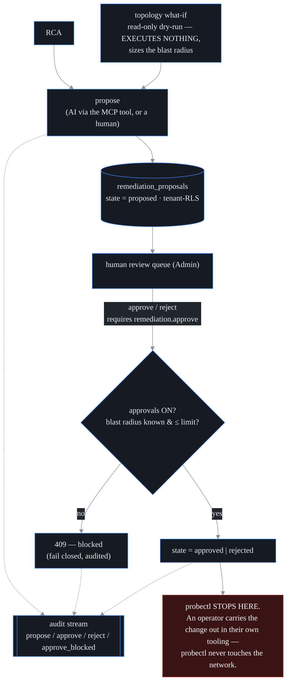

# Guarded agentic remediation (Enterprise: `remediation`)

> **The contract in one line:** probectl proposes; a human decides; nothing in
> probectl ever executes a network change. This rule has the same standing as
> the project's [Non-negotiables](../CONTRIBUTING.md#non-negotiables) and is
> enforced structurally below.

**What this is.** probectl's assistant can already do cross-plane root-cause
analysis (RCA) and simulate the impact of a topology change (the "what-if"). This
feature lets it take one more step: **propose** a remediation grounded in that
analysis — and then **stop**.

The single most important sentence in this document: **probectl never executes a
remediation.** A human reviews each proposal and, if approvals are enabled, records
an **approval** — a signed, audited sign-off that an operator then carries out in
their *own* change process. There is **no executor anywhere in the codebase**.
Approving a proposal changes a database row and writes an audit entry; it never
reroutes traffic, mutates a device, or touches the network.

This is the highest-care feature in the product. It is built to the letter of
probectl's remediation rule — *observe-only / human-gated by default; never ship
un-gated autonomous network actions* — and the standing rule that **ingested data
must never trigger or approve an action**. The core model + seam are in
`internal/remediation`; the workflow is the Enterprise `remediation` feature in
`ee/remediation`, installed at the editions attach seam (core never imports `ee/`).

---

## The ratified policy

These parameters were signed off by the human owner before any code was written —
that sign-off is itself part of the policy. They are not defaults to tune away in
code — changing them is a product decision, not an engineering one.

1. **Proposal-only — there is no executor.** The lifecycle is
   `proposed → approved | rejected`. "Approve" is a recorded human authorization;
   an operator then performs the change out-of-band. There is deliberately no
   `executed` state and no `Apply` / `Execute` / `Run` method on the service — a
   unit test (`TestNoExecutor`) fails the build if anyone ever adds an
   `Apply`/`Execute`/`Run`/`Perform`/`Act`/`Remediate`/`Dispatch`/`Enact`
   method. A fourth state,
   `applied`, exists only as an **operator's note** that they carried the
   suggestion out elsewhere; it changes nothing in probectl.

2. **Ingested data can never trigger or approve an action.** The AI's
   `propose_remediation` MCP tool can only ever create a `proposed` proposal. The
   *only* path to `approved` is the authenticated `POST
   /v1/remediation/proposals/{id}/approve` route, which requires a human holding
   the `remediation.approve` permission. A prompt-injection buried in telemetry
   can, at worst, cause a proposal to appear in the review queue — never an
   approval, and never an action.

3. **Advisory-only by default.** Approvals are **off** until an operator sets
   `PROBECTL_REMEDIATION_APPROVALS_ENABLED=true`. Until then the assistant still
   proposes and humans still review, but Approve is unavailable (the API returns
   `409 approvals_disabled`; the UI disables the button and shows an advisory-only
   banner).

4. **Single-admin approve.** Any authenticated principal holding
   `remediation.approve` (an admin permission) can approve. A future
   second-approver / change-window gate can layer on without changing this model.

5. **Blast-radius limited.** Every proposal carries a **dry-run** — a read-only
   topology what-if that sizes how many services, prefixes, and hosts the change
   would affect. A proposal whose blast radius exceeds
   `PROBECTL_REMEDIATION_MAX_BLAST_RADIUS` (default `50`) **cannot be approved**.
   An *unknown* blast radius (topology unavailable) is also blocked — **fail
   closed**. Blocked approval attempts are themselves audited.

6. **Fully audited.** Propose, approve, reject, and *blocked* approvals are written
   to the tenant's tamper-evident audit stream (`remediation.propose`,
   `remediation.approve`, `remediation.reject`, `remediation.approve_blocked`).

---

## Architecture

The feature follows the editions seam pattern: a **core** model + interface, an
**`ee/`** implementation, mounted at the attach seam and gated by the `remediation`
Enterprise feature. Core never imports `ee/`.

| Piece | Location | Edition |
|---|---|---|
| Proposal model, `Service` + `Estimator` interfaces, typed errors | `internal/remediation` | core |
| Propose→approve→reject workflow, advisory-only switch, blast-radius guards, audit | `ee/remediation` (remediation.go) | `remediation` (Enterprise) |
| Postgres store (tenant-RLS) | `ee/remediation` (store.go) | `remediation` |
| Dry-run estimator (topology what-if) | `ee/remediation` (estimator.go) | `remediation` |
| `propose_remediation` MCP tool (proposal-only) | `internal/ai/mcp` | core seam, backed by the ee service |
| `/v1/remediation/*` routes + Admin card | `internal/control`, `web/` | core seam (404 hidden when unlicensed) |

## Dry-run (blast radius)

The estimator runs `topology.Simulate` over a **copy** of the tenant's topology
graph — the same what-if that powers the UI's impact preview — failing the
proposal's target element and counting the affected entities. Blast radius =
impacted services + impacted prefixes + newly-disconnected hosts. It reads the
graph and computes; it mutates nothing and calls nothing external. If the target is
unknown or no topology is loaded, the dry-run returns an **unknown** radius
(`BlastRadius: -1` with an "unknown" note), which blocks approval — fail closed.

## API

All routes are tenant-scoped and hidden (404) when the feature is unlicensed.

| Method · Route | Permission | Notes |
|---|---|---|
| `GET /v1/remediation/proposals` | `remediation.propose` | list (newest first) + `approvals_enabled` |
| `POST /v1/remediation/proposals` | `remediation.propose` | files a proposal — always `proposed` |
| `GET /v1/remediation/proposals/{id}` | `remediation.propose` | one proposal |
| `POST /v1/remediation/proposals/{id}/approve` | `remediation.approve` | the ONLY path to `approved`; fails closed |
| `POST /v1/remediation/proposals/{id}/reject` | `remediation.approve` | records a decline |

Fail-closed approval errors map to `409 Conflict` with a machine code:
`approvals_disabled`, `blast_radius_exceeded`, `blast_radius_unknown`,
`not_proposed`.

## MCP tool

`propose_remediation` (permission `remediation.propose`) lets the assistant file a
proposal. It delegates to the same `Propose` path as the API and can only ever
produce a `proposed` proposal — the tool catalog exposes **no** approve / execute
tool. The proposer is recorded as `ai:propose_remediation`, distinct from the
human `user:<email>` who later decides. On the lightweight `mcp-stdio` transport
the tool is inert (the full workflow rides the HTTP transport wired through the
attach seam); a core file can never import `ee/`.

## Configuration

| Variable | Default | Notes |
|---|---|---|
| `PROBECTL_REMEDIATION_APPROVALS_ENABLED` | `false` | advisory-only master switch |
| `PROBECTL_REMEDIATION_MAX_BLAST_RADIUS` | `50` | approvable blast-radius ceiling (range `1`–`100000`) |

The `remediation.propose` + `remediation.approve` permissions are seeded to the
admin role in migration `0035`.

## What this is NOT

By design, probectl does **not** ship un-gated autonomous remediation — ever.
There is no auto-apply, no "remediate now", no inline enforcement, and
no background actor that acts on a proposal. Approve is a human record, not a
trigger. If a future change ever adds an execution integration, it must remain
human-gated, dry-run-first, blast-radius-limited, tenant- and RBAC-scoped, and
fully audited — and it would require a fresh human sign-off, because it changes
this contract.
