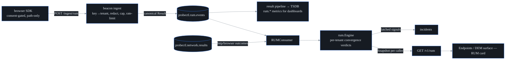

# RUM convergence

## What it is, and why

Real-user monitoring (RUM) measures what **actual visitors'** browsers
experienced — load times, errors — as opposed to **synthetic** tests, which are
scheduled robots probing on a timer. RUM exists to answer **one** question: when
something breaks, are real users actually affected? Synthetics answer "can a
robot reach it?"; RUM answers "are humans hurting?". probectl's value-add is
joining the two — putting both witnesses on the stand and ruling on how their
testimony lines up. That ruling is the *convergence verdict*, computed per
(app, host):

| Verdict | Meaning |
|---|---|
| `healthy` | neither plane is degraded |
| `user_impact_confirmed` | synthetics **and** real users are degraded — the page-worthy case |
| `synthetic_only_no_user_impact` | synthetics red, users fine — a canary, not a crisis (the wording is deliberate: *no user impact **observed***) |
| `user_only_synthetic_blind` | users degraded, synthetics green or absent — visible in the RUM view as a low-trust blind spot, but not paging-grade without another proof source |

When the verdict *transitions* into `user_impact_confirmed`, the engine raises a
warning signal that flows into the incident pipeline (plane `rum`):
`rum.user_impact_correlated`. These signals are **latched** per episode (you get
one signal, not a storm) and re-arm on recovery. The `healthy`, `synthetic_only`,
and RUM-only `user_only_synthetic_blind` states never page from the RUM plane:
alerting/SLOs own synthetic-only stories, and public RUM keys are replayable, so
RUM-only degradation is treated as an uncorroborated blind-spot indicator until
the synthetic plane provides independent proof. The logic lives in
`internal/rum/engine.go`.

## The beacon contract (schema v1)

A **beacon** is one tiny, fire-and-forget HTTP POST a page sends as the user
leaves it — named like the lighthouse flash: a single small signal, no session,
no reply expected. `POST /ingest/rum` is mounted **outside** the
session-authenticated API — same model as the change webhook. Each beacon
authenticates *itself* with its **app key** and is bound to the key's configured
tenant, never to whatever the payload claims. The key is an *identifier, not a secret*: it ships in page source like
every RUM product's site key. It scopes and rate-limits the beacon; it grants no
read access to anything.

```json
{"v": 1, "key": "pk_storefront", "consent": true,
 "host": "web.acme.example", "page": "/checkout/12345",
 "browser": "chrome",
 "vitals": {"ttfb_ms": 120, "fcp_ms": 900, "lcp_ms": 1800, "cls": 0.02, "inp_ms": 180, "load_ms": 2400},
 "errors": 0, "failed_requests": 0, "sdk": "0.1.0"}
```

`host` is the **join key** between the two planes: a synthetic http/browser test
run against the same host is what completes the convergence. Vitals use
**web-vitals** naming — the standard set of browser user-experience timings:
`ttfb_ms` (time to first byte), `fcp_ms` / `lcp_ms` (first / largest contentful
paint — when the first thing, and the main thing, became visible), `cls`
(cumulative layout shift — how much the page jumped around while loading;
unitless), `inp_ms` (interaction to next paint — input responsiveness), and
`load_ms` (full page load). Stored attributes follow OpenTelemetry
semantic-convention names where one exists (`url.path`, `browser.name`). A validated beacon is
normalized into probectl's **one canonical result schema** (with
`canary_type: "rum"`) and published on the `probectl.rum.events` bus topic — so
RUM rides the *existing* pipeline into the time-series database, and Grafana
dashboards get `rum.*` metrics for free, with no parallel plumbing.

## Privacy (enforced server-side, fail closed)

The SDK minimizes what it sends, but the **server** is the real trust boundary,
and it assumes a hostile client. Enforcement is in `internal/rum/beacon.go`:

- **No consent → rejected.** `consent: true` must be explicitly present.
- **Unknown fields → rejected.** The decoder is strict (`DisallowUnknownFields`):
  any payload carrying a field outside the schema is refused outright. A beacon
  trying to smuggle `user_id`, `email`, or `ip` *structurally* cannot ingest.
- **URLs re-redacted server-side.** Query strings and fragments are stripped,
  and volatile path segments (numbers, UUIDs, long hex) collapse to `:id` — one
  pass that buys both privacy and bounded page-group **cardinality** (how many
  distinct series the time-series database must hold — un-collapsed URLs would
  mint one per checkout number).
- **No IP, no user agent stored.** The schema has nowhere to put them; `browser`
  is family-level only (`chrome` / `firefox` / `safari` / `edge` / `other`).
- **Client clocks are untrusted** — the stored timestamp is the server's
  receive time.
- **Rejections are counted and served.** `/v1/rum` returns the per-tenant
  reject counters (`rejected_no_consent`, `rejected_malformed`,
  `rejected_invalid_field`) so the operator can *see* what's being dropped. The
  coverage note states the honest inverse too: *absence of RUM data is not proof
  of health* — opted-out users and uninstrumented apps are simply invisible.

The browser SDK is `web/public/probectl-rum.js` (under 2 KiB minified). It sends
nothing until your consent hook calls `window.probectlRUM.consent()`, honors
Do-Not-Track / Global Privacy Control (the browser-level privacy signals) by
never arming, uses passive `PerformanceObserver`s (the browser's built-in
timing-event listener — it receives measurements the browser was already taking)
plus one `sendBeacon` on `pagehide` (`navigator.sendBeacon` is the browser API
built for exactly this: a tiny async POST the browser delivers even as the page
is being torn down — no performance tax), and transmits the page **path only**.

```html
<script src="https://probectl.example/probectl-rum.js"
        data-key="pk_storefront"
        data-endpoint="https://probectl.example/ingest/rum" defer></script>
<script>
  // after your consent banner accepts:
  window.probectlRUM.consent()
</script>
```

## Ingest hardening (guardrail 12)

The ingest endpoint treats every beacon as untrusted input
(`internal/control/rumapi.go`):

- **App-key auth.** An unknown key gets a `401`, and its rejection is still
  attributed to the right tenant (the key is parsed leniently first, precisely
  for this).
- **Size cap.** 16 KiB max; over that is a `413`.
- **Rate limit.** A per-key **token bucket** — the classic rate limiter: each
  key holds a bucket of tokens refilled at the configured per-minute rate, each
  beacon spends one, and an empty bucket means wait; over the limit is a `429`
  with `Retry-After`. (Set the limit to `0` to disable it.)
- **CORS.** Cross-origin resource sharing — the browser's rules for which
  sites' pages may call which endpoints. This endpoint is write-only and
  credential-less, so a wildcard origin is safe and required — browsers post
  cross-origin from the customer's own site. The SDK uses a `text/plain`
  `sendBeacon` to dodge the CORS **preflight** entirely (the preflight is the
  `OPTIONS` permission request browsers send ahead of cross-origin calls that
  need it; `text/plain` is one of the content types exempt from it); an
  `OPTIONS` handler answers the rest.

## Degradation semantics

RUM is only called *degraded* with **≥ 20 views in the 15-minute window** AND
(error rate ≥ 10% OR p75 LCP ≥ 4000 ms — the web-vitals "poor" line; **p75** is
the 75th percentile, the point three-quarters of views were faster than). A
trickle of views is never called an outage. The synthetic side is *degraded* at ≥ 50%
failures over ≥ 2 samples for the host (web-facing types only: `http`, `https`,
`browser` — results real users could also hit).



## Configuration

| Variable | Default | Purpose |
|---|---|---|
| `PROBECTL_RUM_ENABLED` | `false` | turns on the beacon ingest + convergence engine (it's an inbound surface, so it's opt-in) |
| `PROBECTL_RUM_APPS` | (none) | the app-key registry: `pk_key1=tenant/app,pk_key2=tenant2/app2` (enabled but empty is a startup error — a mis-bound key could file beacons under the wrong tenant) |
| `PROBECTL_RUM_RATE_PER_MIN` | `300` | per-key beacon rate limit (`0` = unlimited) |

Deliberately out of scope: full APM — no traces, no session replay, no
user-journey reconstruction. RUM here is page-level vitals and errors,
converged with synthetics; the strict beacon schema is what makes the privacy
contract enforceable, and a richer payload would erode it.
