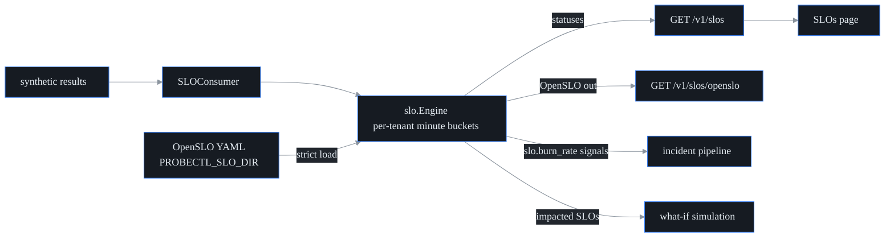

# SLO + business-impact engine

## What this is

An SLO is a promise about reliability, written as a number: "checkout should
succeed 99% of the time." This engine turns that promise into something probectl
watches continuously, and translates it into the language an executive cares
about: *are we keeping the promise, how much room do we have left before we
break it, and is something burning that room down right now?*

It sits in the control plane (`internal/slo`). It reads the same synthetic
probe results probectl already collects, evaluates each SLO **per tenant**, and
raises an alert into the incident pipeline when reliability is being spent too
fast. Definitions are written in **OpenSLO** (an open, vendor-neutral SLO
format), so they move freely between probectl and any other OpenSLO tooling.

Four pieces fit together:

- **SLI/SLO definitions** — what you measure (the good/total ratio) and the
  target you hold it to.
- **Error budgets** — the small amount of failure the target *allows*, treated
  as a spendable balance.
- **Multi-window, multi-burn-rate alerts** — the Google SRE method for paging
  on real problems without paging on noise.
- **Service/team mapping** — every SLO carries a business owner, so reliability
  rolls up to a team, not just a probe target.

## OpenSLO conformance — conform, do not diverge

A definition is a standard OpenSLO v1 document (`apiVersion: openslo/v1`,
`kind: SLO`). probectl evaluates a deliberate *subset* of OpenSLO, and is strict
about it:

- `ratioMetric` indicators (a `good` count over a `total` count) where
  `metricSource.type` is `probectl`
- `budgetingMethod: Occurrences` (count successes vs. attempts — not a
  time-slice method)
- exactly one **rolling** `timeWindow` (`30d`, `7d`, `12h`, …)
- exactly one objective `target`, a ratio strictly between 0 and 1

Anything outside that subset is **rejected loudly when the file loads** — the
YAML parser runs in strict-fields mode, so an unknown or unsupported field stops
startup rather than being silently ignored. Export emits the original document
back unchanged (a lossless round-trip, enforced by a test). The reasoning: an
SLO you *think* probectl is tracking must actually be tracked. Silently dropping
one is worse than refusing to boot.

```yaml
apiVersion: openslo/v1
kind: SLO
metadata:
  name: checkout-availability
  displayName: Checkout availability
  labels:
    team: payments            # the business-unit mapping (showback)
spec:
  service: checkout
  indicator:
    metadata: { name: checkout-probe-success }
    spec:
      ratioMetric:
        good:
          metricSource:
            type: probectl
            spec: { canary_type: http, target: checkout.acme.example, outcome: success }
        total:
          metricSource:
            type: probectl
            spec: { canary_type: http, target: checkout.acme.example }
  timeWindow: [{ duration: 30d, isRolling: true }]
  budgetingMethod: Occurrences
  objectives: [{ target: 0.99 }]
```

A few matching rules worth knowing:

- `target` (the probe target) accepts a trailing `*` as a prefix wildcard
  (`api.*` matches `api.acme.example`, `api-internal.example`, …).
- `canary_type` left empty matches **any** probe type.
- The `good` metric must declare `outcome: success`; `good` and `total` must
  share the same non-empty `target` and the same `canary_type` — otherwise the
  ratio would compare two different things.

Definitions load from the directory named by `PROBECTL_SLO_DIR` (each file may
hold multiple YAML documents separated by `---`). A malformed file, an invalid
duration, or two SLOs with the same name **fails startup**.

## Error budgets + multi-window burn-rate alerts

Start with the intuition. If your target is 99%, you are *allowed* to fail 1% of
the time. That 1% is your **error budget** — a balance you spend as failures
happen. **Burn rate** is how fast you are spending it:

```
burn rate = errorRate(window) / (1 − target)
```

At burn rate 1, you spend exactly the whole budget over the SLO window and land
on empty right at the end — sustainable by definition. At burn rate 14.4, you
spend the entire month's budget in about two days — an emergency.

The hard part of alerting is telling a real outage apart from a blip. probectl
uses the Google SRE answer: require **two** windows — a long one and a short one
— to *both* exceed the threshold before it fires (a logical AND). The long
window proves the problem is sustained (kills noisy, flappy alerts); the short
window proves it is still happening right now (kills slow, stale alerts that
fire long after recovery).

| Tier | Long window | Short window | Burn ≥ | Severity |
|---|---|---|---|---|
| fast | 1h | 5m | 14.4 | critical (page) |
| medium | 6h | 30m | 6 | critical (page) |
| slow | 3d | 6h | 1 | warning (ticket) |

Worked example, against the 99% checkout SLO above (so `1 − target` = 0.01). Say
over the last hour 14.4% of probes failed: `0.144 / 0.01` = burn rate 14.4. If
the last 5 minutes are also failing at ~14.4% or worse, **both** the fast long
and fast short windows clear 14.4, and the engine pages. If the 5-minute window
has already recovered, nothing fires — the incident is over.

When a tier first crosses, the engine raises a `slo.burn_rate` signal (plane
`slo`) into the incident pipeline. Signals are **latched per window per
episode**: one signal when a tier starts firing, and it re-arms only after the
*long* window drops back under the threshold. Clearing on the long window (not
the short one) is deliberate hysteresis — it stops a single episode from
flapping out a stream of alerts on short-window jitter.

## Cold start — an empty baseline is not an outage

A brand-new SLO, or one whose probes barely run, has almost no data. A single
failure out of three probes is a 33% error rate, which would trivially trip
every burn threshold — a false alarm. So the engine stays quiet until an SLO has
seen at least **50 events** in its full window, and reports `cold_start: true`
until then.

The threshold is checked against the **full SLO window**, not against each
alert window. That distinction matters: a low-cadence probe (say one every few
minutes) might never accumulate 50 events inside the 1-hour *fast* window, so
gating on the alert window would make fast alerts permanently dead. Gating on
the full window instead lets slow probes still get fast alerts once they have
enough history overall.

## Surfaces

- `GET /v1/slos` (permission `metrics.read`) — the caller's tenant's SLO
  statuses: attainment, error budget remaining, total events, the cold-start
  flag, and per-window burn rates with their firing state.
  `slo_running: false` means the engine is not wired in.
- `GET /v1/slos/openslo` (permission `metrics.read`) — the loaded definitions
  as an OpenSLO v1 YAML stream. Definitions are deployment-level configuration;
  statuses are per tenant, so this endpoint returns the shared definitions and
  `/v1/slos` returns the tenant-scoped numbers.
- **SLOs page** (`/slos`) — the executive dashboard: attainment vs. objective,
  an error-budget bar, burn-rate badges, service/team labels, and honest
  cold-start and not-wired states.
- **What-if integration** — a failure simulation reports `impacted_slos`, the
  SLOs whose service or probe target sits inside the simulated blast radius, so
  "what breaks if this link dies?" answers in SLO terms.



Under the hood the engine keeps per-tenant, per-minute buckets of `good`/`total`
counts, pruned to the SLO window. Burn over any window is computed by summing
the buckets in that window — so the same data answers both the live status and
the alert evaluation.

## Configuration

| Variable | Default | Purpose |
|---|---|---|
| `PROBECTL_SLO_ENABLED` | `true` | the engine + result consumer (local-only) |
| `PROBECTL_SLO_DIR` | (none) | directory of OpenSLO YAML definitions; empty means zero SLOs, honestly reported |

Out of scope by design: application-level SLOs. probectl correlates the network
planes; it does not own application instrumentation.
