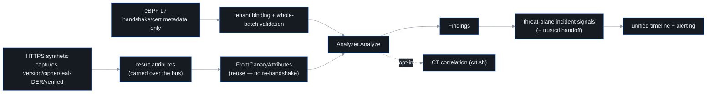

# TLS / certificate observability

## What it is

Every time probectl's HTTP synthetic canary makes an HTTPS request, a **TLS
handshake** happens — the opening exchange of every HTTPS connection, in which
the server presents its **certificate** (its signed identity document) and the
two sides agree a protocol version and a **cipher** (the encryption suite).
That handshake *already tells you* the server's
certificate, TLS version, and cipher. The **TLS observability** layer harvests
that information probectl has **already captured** and analyzes it for posture
problems: certs about to expire, weak keys, deprecated TLS versions, untrusted
chains, and so on. The observation model is source-tagged — `http` | `ebpf`.
HTTPS synthetics feed their captured handshake, while the eBPF L7 lane projects
only privacy-minimized certificate/handshake metadata. It never copies method,
resource, headers, or decrypted payload into the posture inventory.

The key design choice is in the name: it **observes**, it does not re-probe. It
never opens a second connection or re-handshakes a target just to inspect the
cert — that would be wasteful and would double the load on the very services
you're watching. It reuses what the existing probe saw, the way a doctor reads
the X-ray already taken during the visit instead of ordering a second scan.
This is the
trustctl-adjacent security win: cheap, because the handshake came for free.

## How it works

The flow, step by step:

1. **Capture.** The HTTPS canary records the TLS facts it observed during its
   normal handshake — the negotiated version and cipher, whether the chain
   verified (i.e. whether the cert traces back to a trusted authority), and the
   **leaf** certificate's (the server's own cert, the end of the chain) raw
   **DER** bytes (the certificate's binary encoding) — as result attributes
   (`tls.protocol.version`, `tls.cipher`, `tls.server.verified`,
   `tls.server.cert`). The observation also carries `tls.ja3` / `tls.ja3s`
   fingerprint fields when a capture source supplies them (**JA3** hashes a
   *client's* handshake parameters into a fingerprint of the client software;
   **JA3S** is the server-side counterpart) — the HTTPS canary
   does not emit them today.
2. **Rehydrate, don't re-fetch.** `threat.FromCanaryAttributes` turns those
   attributes back into a `TLSObservation` — parsing the leaf DER into a real
   certificate object. It opens **no** new connection. If the result carried no
   TLS (a plain HTTP probe), it returns "nothing to analyze".
3. **Analyze.** `threat.Analyzer.Analyze` inspects the handshake facts and the
   parsed leaf, emits severity-scored findings, and (when there's a renewable
   cert problem) builds a trustctl handoff payload.
4. **Preserve uncertainty.** An eBPF record with `encrypted_unknown`,
   `sidecar_unknown`, or `unsupported` visibility becomes an explicit
   unknown/unsupported posture. A malformed, unscoped, mixed-tenant, or
   registry-mismatched batch mutates nothing. The API labels source, capture
   mechanism, confidence, and read-time freshness (`current` ≤10 minutes,
   otherwise `stale`).

## What it flags

From the captured handshake and the parsed leaf certificate, the analyzer flags:

- **expired** certs (critical) and **expiring-soon** certs (within a
  configurable window — `PROBECTL_TLS_EXPIRY_WARNING`, default 21 days);
- **not-yet-valid** certs;
- **self-signed** certs (issuer == subject);
- **weak RSA keys** (below 2048 bits);
- **deprecated TLS** (1.0 or 1.1);
- **weak ciphers** (anything matching RC4 / 3DES / DES / NULL / EXPORT / MD5 /
  anonymous);
- an **untrusted chain** — the capturing client's own verification failed
  (critical).

Each finding is severity-scored and surfaced as a **threat-plane incident
signal**. Crucially, it is a **signal, not an IPS**: probectl never blocks
traffic or sits inline. It tells you the cert is bad; acting on it is your call.

## trustctl handoff

A certificate finding is *actionable* — usually "renew or replace this cert" — so
the analyzer builds a **trustctl handoff** payload: the cert's subject, issuer,
SANs (Subject Alternative Names — the hostnames the cert is valid for),
serial, expiry, and the reason. When `PROBECTL_TRUSTCTL_URL` is set, it
also assembles a one-click deep link
(`<trustctl>/renew?domain=…&serial=…&reason=…`) carried in the signal
attributes, so an operator can jump straight from "this cert is expiring" to the
renewal flow in the sibling product — the finding arrives with the renewal form
pre-filled.

## CT correlation (opt-in)

When you enable it with `PROBECTL_CT_ENABLED=true`, probectl correlates a leaf's
serial number against **Certificate Transparency** (CT) logs — the public,
append-only registries where every legitimately-issued certificate is supposed
to be recorded (crt.sh by default;
`PROBECTL_CT_ENDPOINT` overrides). A serial that CT has **never seen** is
flagged as an info-severity *issuance anomaly* — like a person with no entry
in the birth registry: not proof of forgery, but a possible sign the cert was
minted outside the normal pipeline, and worth a look.

It is **off by default** on purpose: it's an outbound fetch to a third party,
which collides with the no-phone-home / sovereignty stance. When enabled it
behaves like every external feed in probectl — it respects crt.sh's AUP and rate
limits, fetches over validated TLS, and **degrades gracefully**: a CT source
that's down or throttled is a silent no-op, never an error that breaks posture
analysis. The checker caches bounded serial/fingerprint results, paces requests
per CT host, opens an exponential-backoff circuit after upstream errors or
non-200 responses, and exports aggregate `probectl_ct_*` counters for cache
hits/misses, attempted requests, skipped lookups, and degraded lookups.

## Coverage caveat — what feeds the inventory, and the Go-server blind spot

The observation model defines two capture sources, and they see different
things:

- The **HTTP synthetic** path (`source: http`) sees the certificate
  **probectl's own client** negotiated. This works whenever probectl initiates
  the handshake.
- The **eBPF L7** path (`source: ebpf`) is wired to the same inventory. A source
  that supplies validated version/cipher/certificate metadata **and a
  destination** yields an observed posture; the recorded fixture is the
  deterministic acceptance path. The current live C-library plaintext uprobe does
  not pretend it can derive certificate posture from decrypted bytes: it emits
  `encrypted_unknown` until a trustworthy handshake-metadata source is present.
  Sidecars likewise stay `sidecar_unknown`.

  **An `encrypted_unknown` record from the live uprobe does not reach this
  inventory today**, and the reason is the destination rather than the posture: a
  uprobe sees an `SSL_write` buffer, not the socket's peer, so it has no target to
  key a row on ([limitations.md](limitations.md#built-not-yet-served-edges),
  DPR-196). Such records are counted under `no_destination` and summarized in the
  control-plane log; they are not a fault and no longer void the batch they
  arrive in. A **Go server terminates TLS inside the Go runtime**, not in
  a system TLS library probectl's uprobes attach to, so Go `crypto/tls` metadata
  capture remains [a documented post-GA limitation](limitations.md#built-not-yet-served-edges) (see
  [`ebpf-feasibility.md`](ebpf-feasibility.md)).

The synthetic path is unaffected by either caveat: anything you point an HTTPS
test at lands in the inventory.

## Out of scope

- **Malicious-cert / JA3 threat-intel correlation** — matching cert
  fingerprints and JA3 fingerprints against feeds like SSLBL is the
  *threat-intel* layer's job (it reuses the same captured TLS via the
  analyzer's `WithIntel` hook), not this posture layer's. Here, **JA3 / JA3S
  are carried as observed fields when a source supplies them, never scored**.
- **Full NDR detections** — also a separate layer.

## The posture surface

The analyzed posture is retained as a tenant-scoped, in-memory **inventory** (the
latest posture per target, bounded per tenant, clean certs included) and served
at `GET /v1/tls/posture` (RBAC `threat.read`, added in migration 0023; a
`collector_running=false` flag distinguishes an unwired collector from a
genuinely empty fleet, so an empty page never lies about why).

The web surface lives at `/security`:

- the certificate inventory, including evidence source, capture mechanism,
  observed/unknown/unsupported state, confidence, and freshness (filterable by issuer/SAN text and by flag —
  expired / expiring / weak / self-signed / CT / intel);
- an **expiring-soon worklist** (≤30 days, soonest first);
- a per-cert detail view whose **trustctl handoff is the analyzer's payload
  verbatim** — you copy the exact JSON and use the payload's own deep link, never
  a value re-derived in the browser.

The inventory rebuilds itself from the HTTPS-result and eBPF streams after a
restart. The derived-only/raw-history decision is recorded in
[`docs/adr/ebpf-raw-history.md`](adr/ebpf-raw-history.md).
