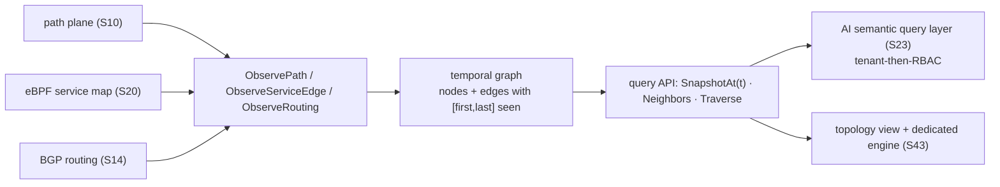

# Topology graph (S30 — F40 foundation)

`internal/topology` is probectl's live, **versioned/temporal**, **tenant-scoped**
network graph. It is built from the planes this milestone produced — path (S10),
the eBPF service map (S20), and routing (S14) — and it is the model the AI
semantic query layer (S23) traverses for root-cause analysis, the topology view
(S43) renders, and the dedicated graph engine (S43) later replaces.

## Model

- **Nodes** (`NodeKind`): `agent`, `hop` (traceroute responder), `host` (path
  target), `service` (eBPF workload), `prefix` (BGP), `as`. Stable ids —
  `hop:<ip>`, `service:<workload>`, `as:<asn>`, `prefix:<cidr>`, ….
- **Edges** (`EdgeKind`): `path` (hop→hop adjacency), `flow` (service→service),
  `routing` (as→prefix). Edge attributes follow OTel conventions where they exist
  (`destination.port`, `network.transport`, `network.protocol.name`).

## Versioning / temporal (designed in, not bolted on)

Every node and edge carries a **validity interval** `[FirstSeen, LastSeen]`;
re-observation extends it and merges attributes. So:

- `SnapshotAt(t)` returns the graph **as it was at time `t`** — the state at an
  incident time, which is exactly what RCA needs.
- `Latest()` returns the full current graph.

## Query API (the contract S23 / S43 consume)

The `Store` interface is tenant-scoped — every call takes a tenant and **never
returns another tenant's graph** (CLAUDE.md §7 guardrail 1):

- `SnapshotAt(tenant, t)` / `Latest(tenant)` — the graph, or its state at `t`.
- `Neighbors(tenant, nodeID, t)` — adjacency.
- `Traverse(tenant, from, to, t)` — shortest directed path (the RCA traversal).
- `Observe{Path,ServiceEdge,Routing}(tenant, …, at)` — fold telemetry in.

`MemoryStore` is the in-memory implementation; the Postgres/ClickHouse adjacency
backing and the S43 dedicated engine implement the **same interface**. The
`From{Path,ServiceEdge,BGPEvent}` adapters map the real signal types (S10/S20/S14)
into the builder inputs, so a bus consumer feeds the graph from live telemetry.

## Visualization

`ToViz(snapshot)` projects a snapshot to a layout-agnostic node/edge JSON shape
(`Viz`) for the S43 topology view and the UI; positions are computed client-side.

## Out of scope (later)

What-if / simulation and the dedicated graph engine (S43); a REST endpoint and
the rendered topology view (S43); dependency mapping beyond the available signals.
S23 adds the RBAC-aware cross-store query layer on top of this foundation.
