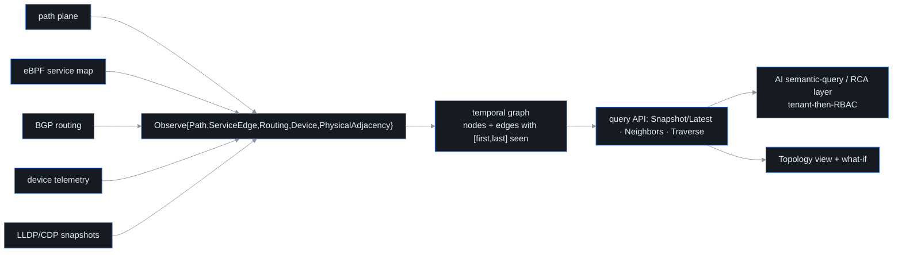

# Topology graph

## What this is

A network has a *shape*: agents reach targets through a chain of router hops,
services call other services, autonomous systems originate prefixes (an
**autonomous system** is one independently-operated network, like an ISP; a
**prefix** is the block of IP addresses it announces to the world), devices
carry interfaces. `internal/topology` is probectl's live model of that shape — a
**tenant-scoped**, **versioned (time-travelling)** graph (a graph is just
nodes — the things — and edges — who touches whom) that stitches together
the signals the other planes already produce:

- **path** discoveries (traceroute) → agent → hop → hop → host adjacency;
- the **eBPF service map** (eBPF watches connections from inside the kernel) →
  service → service call edges;
- **BGP routing** events → autonomous-system → prefix origin edges;
- **device telemetry** → device nodes (and device → hop links where the
  telemetry exposes interface IPs);
- **LLDP/CDP neighbor snapshots** → direct device/port `physical` edges.

It is the substrate two things sit on top of: the AI semantic-query / root-cause
layer traverses it to explain *why* an incident happened, and the Topology page
in the UI renders it. Because it is one shared graph, a single failure can be
reasoned about across planes — "this hop went down, which broke these paths,
which back these services, which back these SLOs."

## Model

A node and an edge each have a **kind** and a **stable id**, so the same router
or service observed by two different planes folds into one vertex — the id
derives from the identity itself (a passport number, not a visitor badge), so
every sighting lands on the same vertex.

- **Nodes** (`NodeKind`): `agent`, `hop` (a traceroute responder / L3 hop),
  `host` (a path target), `service` (an eBPF workload), `prefix` (a BGP prefix),
  `as` (an autonomous system), `device` (a managed network device). Ids are
  derived from the identity, so they're stable across observations:
  `agent:<id>`, `hop:<ip>`, `host:<ip>`, `service:<workload>`, `prefix:<cidr>`,
  `as:<asn>`, `device:<address>`.
- **Edges** (`EdgeKind`): `path` (hop → hop adjacency), `flow` (service →
  service), `routing` (as → prefix), `device` (device → the hop it carries, via
  an interface IP), `physical` (a directly observed LLDP/CDP local-port →
  remote-port adjacency). An edge's canonical id is `from|kind|to`. Edge attributes
  follow OTel conventions where they exist — a `flow` edge carries
  `destination.port`, `network.transport`, and `network.protocol.name`.

## Versioning / temporal (designed in, not bolted on)

Every node and edge carries a **validity interval** `[FirstSeen, LastSeen]`.
Re-observing an element extends its interval and merges its attributes, so the
graph remembers *when* each thing existed. It is a ledger of sightings, not a
photo that gets repainted — and replaying the ledger to any moment is exactly
what root-cause
analysis needs (the graph as it was at the incident moment, not as it is now).

- `ForTenant(tenant).SnapshotAt(t)` returns the graph **as it was at time `t`**.
- `ForTenant(tenant).Latest()` returns the full current graph.
- Retention is store-owned: `PROBECTL_DERIVED_IDENTITY_RETENTION_DAYS` prunes
  stale topology nodes and edges from `Latest()`, historical `SnapshotAt`,
  `Neighbors`, and `Traverse`, and records `lifecycle.retention_sweep` receipts
  when labels are deleted. A tighter tenant `flow_retention_days` shortens the
  derived-cache window.

```mermaid
%%{init: {'theme':'base','themeVariables':{'background':'#0d1117','primaryColor':'#161b22','primaryTextColor':'#e6edf3','primaryBorderColor':'#3b82f6','lineColor':'#8b949e','secondaryColor':'#21262d','tertiaryColor':'#0d1117','clusterBkg':'#161b22','clusterBorder':'#30363d','fontFamily':'ui-monospace, SFMono-Regular, Menlo, monospace'},'flowchart':{'curve':'basis','nodeSpacing':55,'rankSpacing':55,'padding':12}}}%%
flowchart LR
  P["path plane"] --> B
  F["eBPF service map"] --> B
  R["BGP routing"] --> B
  D["device telemetry"] --> B
  N["LLDP/CDP snapshots"] --> B
  B["Observe{Path,ServiceEdge,Routing,Device,PhysicalAdjacency}"] --> G["temporal graph<br/>nodes + edges with [first,last] seen"]
  G --> Q["query API: Snapshot/Latest · Neighbors · Traverse"]
  Q --> AI["AI semantic-query / RCA layer<br/>tenant-then-RBAC"]
  Q --> UI["Topology view + what-if"]
```

## Query API (the contract everything else consumes)

The `Store` interface (`internal/topology/store.go`) is tenant-bound: callers
first ask for `ForTenant(tenant)` and receive a `TenantStore`. That handle has
no tenant-string arguments, so a later read/write cannot accidentally swap in a
different tenant. Tenant isolation is probectl's outermost boundary (see
[`security/tenant-isolation.md`](security/tenant-isolation.md)); the topology
store enforces it below the API/AI/RBAC layer.

- `SnapshotAt(t)` / `Latest()` — the bound tenant's graph, or its state at `t`.
- `Neighbors(nodeID, t)` — a node's adjacency (the nodes touching it) at `t`.
- `Traverse(from, to, t)` — the shortest directed path between two nodes (the
  traversal RCA — root-cause analysis — walks).
- `Observe{Path,ServiceEdge,Routing,Device,PhysicalAdjacency}(…, at)` — fold one
  plane's telemetry into the bound tenant's graph.
- `IdentityConflicts()` — return the bound tenant's bounded cross-source
  disagreement records. The handle accepts no tenant argument, so a caller
  cannot query a second tenant after binding.

Invalid or empty tenant scopes fail closed. Reading a never-seen tenant returns
an empty snapshot without creating a graph.

`MemoryStore` is the simple in-memory implementation. The `From{Path,
ServiceEdge,BGPEvent}` adapters (`internal/topology/adapters.go`) map the real
signal types into the builder inputs, so a bus consumer can feed the graph
straight from live telemetry. The indexed engine below and any external
graph-database adapter implement this *same* tenant-bound interface — callers
never change.

## All planes feed the live graph

`TopologyConsumer` (`internal/control/topologyapi.go`) folds the streams the
control plane already receives into the graph: eBPF service edges
(`probectl.ebpf.flows`), BGP routing events (`probectl.bgp.events`), and device
telemetry (`probectl.device.metrics`). Path discoveries fold in at save time.
Every batch's claimed tenant is verified against the agent registry; unscoped or
unverifiable records are dropped (guardrail 1).

Bounded LLDP/CDP snapshots arrive separately on
`probectl.device.neighbors`. The consumer verifies the tenant-namespaced lane,
agent registry, and every normalized row, persists the current snapshot before
acknowledging it, then folds only directly observed `physical` edges into the
tenant-bound graph. Missing neighbor evidence leaves the edge absent.

Device → hop linkage depends on the telemetry exposing interface IPs. When it
does (`ObserveDevice` with `InterfaceIPs`), the device node links to the hops it
carries. When it does not — which is the case for the SNMP/gNMI device telemetry
today — the device node still exists, but **without** links, and that gap is
**reported** as a coverage note (below), never silently treated as "complete."

Before a device observation updates the graph's visible label, the graph also
retains its normalized source claim. Distinct management-address, device-name,
interface-address, interface-name, or interface-index values become stable
read-only conflict records instead of disappearing behind last-writer-wins.
These records are a replayable derived view, not a new system of record: bus
replay rebuilds them after restart, the per-tenant graph caps their memory, the
derived-identity retention sweep prunes their evidence, and tenant erasure
drops them with the graph. They never pick a winner or mutate topology.

## What-if / impact simulation

`Simulate` answers: *"if node or link X fails, what breaks?"* — a fire drill
run on the floor plan, never the building. It runs on a
snapshot of the versioned graph (a zero time = the live graph), removes the
failed element, and recomputes reachability. Fail any node (`hop:…`, `service:…`,
`as:…`, `prefix:…`, `device:…`, `agent:…`) or any edge (`from|kind|to`) and you
get:

- **broken** agent→target paths — routes with no surviving alternative;
- **rerouted** paths — with the surviving route returned alongside the original;
- **impacted services** — the transitive callers of a failed service/host:
  walk the call arrows *backwards* and collect everyone that depends on it,
  directly or through intermediaries
  (reverse reachability over `flow` edges);
- **impacted prefixes** — prefixes a failed AS originated (a failed prefix is its
  own impact);
- **disconnected** nodes — reachable from some agent before, from none after;
- **SLO impact** — via the `SLOSource` seam (when the SLO engine is wired;
  absent = an explicit coverage note, never a silent empty).

Three honesty rules matter. First, an **unknown target is an error**, never an
empty "no impact" — a typo in a simulation must not look like a clean result.
Second, simulation accuracy depends on graph completeness, so every result
carries a **coverage block** — per-plane edge counts, including physical edges,
plus notes for missing
planes ("no flow-plane (eBPF) edges — service impact may be incomplete"). Read
it like the station count printed on a weather forecast: trust the prediction
in proportion to how many stations reported. The
simulation is strictly **read-only**: it runs on a copy and never mutates the
graph. Acting on a prediction is a separate, human-gated capability (see
[`remediation.md`](remediation.md)) — probectl predicts, a human decides.
Third, a name or management address alone never creates a physical edge:
LLDP/CDP port evidence is required.

## Visualization

`ToViz(snapshot)` projects a snapshot to a layout-agnostic `Viz` shape — just
nodes (`id`, `kind`, `label`) and edges (`from`, `to`, `kind`, `label`). The UI
computes positions client-side, so the server stays layout-agnostic.

## Engine: in-memory vs indexed

`IndexedStore` implements the same `Store` contract as `MemoryStore`, but backs
it with forward/reverse adjacency indexes, so `Neighbors` and `Traverse` are
proportional to a node's degree (how many edges touch it) instead of the whole
edge set — the behaviour
large graphs need. The engine is selected by `PROBECTL_TOPOLOGY_ENGINE`
(`indexed`, the default | `memory`); the switch is transparent behind the query
API. A scale test exercises both correctness and interactivity at roughly 30k
nodes. An external graph-database adapter can implement the same interface when
a deployment outgrows a single process.

## API + surface

- `GET /v1/topology[?at=RFC3339]` — the caller's tenant graph (live, or as it was
  at `?at=`), in the layout-agnostic node/edge shape plus the coverage block.
  Permission: `topology.read`. (When topology isn't wired on a deployment, the
  endpoint returns `topology_running: false` with empty node/edge lists.)
- `POST /v1/topology/whatif {target, at?}` — the simulated impact for failing one
  node or edge. Permission: `topology.read`. The response names affected path
  tests by their observed agent and target, reports broken/rerouted routes,
  services, prefixes, disconnected nodes, known SLO impact, explicit coverage
  gaps, and a coverage-derived confidence score. That score says how many
  evidence seams are wired; it is not a probability. An unknown target is a
  `404`.
- `GET /v1/topology/whatif/export?target=...&at=...` — reruns the same
  tenant-scoped, read-only calculation and downloads its JSON result. The route
  is RBAC-gated and recorded as an export in the tenant audit trail.
- The **Topology** page renders the layered graph (columns by kind, capped for
  legibility on dense graphs with an honest "showing N of M"), node drill-down,
  one version clock, and an explicit added/removed/changed node-and-edge diff.
  Scrubbing the clock preserves the selected entity. Incident evidence can pivot
  into the selected entity and open the what-if overlay in two interactions
  while preserving the incident, evidence, time range, filters, and return path.
  The overlay is labelled **observe-only dry-run** and shows affected tests,
  services, the authorized linked incident, routes, known SLOs, confidence, and
  gaps before offering the audited JSON export.
- `GET /v1/device/identity-conflicts` — bounded conflict/provenance rows and
  exact affected-correlation pivots. Permission: `topology.read`; every
  successful read is tenant-audited. The same review-only card is present in
  the Topology and Device workflows. `topology_running:false`, truncation, and
  clean/filtered-empty states are distinct.
- `GET /v1/device/neighbors` — bounded current/stale LLDP/CDP rows with direct
  device/port provenance, freshness, and confidence. Permission:
  `topology.read`; reads are tenant-audited. The same data appears in
  **Planes → Device** and `probectl device neighbors`.

## Out of scope (by design)

Acting on what-if predictions or preventing the simulated failure (those are
separate, human-gated remediation capabilities); dependency mapping beyond the signals the planes actually emit
(probectl links what it observes, and reports the gaps where it can't). The
AI/RBAC-aware query layer sits *on top of* this graph, enforcing tenant first,
then RBAC — the topology store itself is the tenant-scoped foundation.
